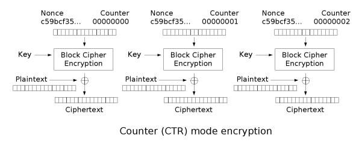

# CryMePlx (cybersecurity rumble ctf 2022)

> Description: Awesome service. Now I don't need to encrypt anything myself!
> Connect via: `nc chall.rumble.host 2734`

[与えられたzipファイル](./given_files/download_cry_intro.zip)をダウンロードし解凍すると，[encrypt.py](./given_files/encrypt.py)が手に入る．\
ソースコードをみると，16バイト（=128ビット）の鍵を使用したAES-128で，flagと入力文字列を暗号化していることがわかる．
> 参考：[PycryptoでのAES暗号化](https://morioh.com/p/c96bcbf9c28f)

```python
from Crypto.Cipher import AES
from secret import flag
import os

kwargs = {"nonce": os.urandom(8)}
key = os.urandom(16)

def encrypt(msg):
    aes = AES.new(key, AES.MODE_CTR, **kwargs)
    return aes.encrypt(msg).hex()

print(encrypt(flag))
q = input("Encrypt this string:").encode()
print(encrypt(q))
```

CTRの暗号化の仕組み：
<figure><figcaption></figcaption></figure>

> 参考：[暗号利用モード](https://ja.wikipedia.org/wiki/%E6%9A%97%E5%8F%B7%E5%88%A9%E7%94%A8%E3%83%A2%E3%83%BC%E3%83%89), [暗号利用モードCTRについて](https://qiita.com/asksaito/items/130863fe9e6a08dcd65d)

ソースコードの脆弱性は，鍵と初期化ベクトルを使い回していること．

フラグの暗号化：

$$Ciphertext1 = flag \oplus AES(Key, Nonce)$$

ユーザの入力文字列の暗号化：

$$Ciphertext2 = input \oplus AES(Key, Nonce)$$

よって，フラグは
```math
\begin{eqnarray*}
flag &=& AES(Key, Noce) \oplus Ciphertext1 \\
&=& Ciphertext2 \oplus input \oplus Ciphertext1
\end{eqnarray*}
```
と求まる．

```python
from pwn import *
import binascii

context.log_level = 'debug'
p = remote('chall.rumble.host', 2734)

enc_flag = binascii.unhexlify(p.recvline().strip())
input = 'A' * len(enc_flag)
p.sendlineafter('Encrypt this string:', input)
enc_input = binascii.unhexlify(p.recvline().strip())

flag = xor(input, enc_input, enc_flag)
log.success(f'{flag=}')
```