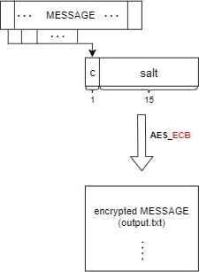

# Perfect Synchronization
(2023/04/09追記：配布ファイルの再配布が禁止されていたことに気づいたため，これらを削除しました．)

## 概要
- `source.py`と`output.txt`が与えられている．
- ブロック暗号であるAESを用いてフラグを暗号化しているが，AES内のブロック暗号の暗号化方式がECBモードである．
- ECBは脆弱なので，そこを突く

## 考察と解答
### `source.py`から分かること
`source.py`を見ると，flagがどのように暗号化されているのかが分かる．

flagは15バイトのソルトを用いて1文字ずつブロック化されている．つまり，1ブロック16バイトであり，フラグの各1文字が1ブロックに対応している．(下図参照)

本問では，親切にもこの暗号化の結果を1ブロックずつ`output.txt`に書き出してくれている．

### `output.txt`から分かること
`output.txt`を眺めると，重複する行が沢山あることに気づく．
`cat output.txt | sort | uniq | wc -l`として，重複行を取り除いた行数をカウントしてみると，30種の行から構成されていることが分かる．
これは，`source.py`の5行目に書かれている，flagが大文字ローマ字26種か`{`, `}`,` `,`_`の全30種の文字から構成されているという事実と対応している．

ただ，`output.txt`は全部で1479行あり(`wc -l output.txt`せよ)，この全てがflagというわけではない．
そのため，頻度分析を行って，`output.txt`のどこにflagがあるのかを発見できないか試す必要がある．

[`anal.sh`](./anal.sh)を使って頻度分析を行うと，`fbe86a428051747607a35b44b1a3e9e9`および`c53ba24fbbe9e3dbdd6062b3aab7ed1a`が1回しか使われておらず，`{`または`}`であることが分かる．`output.txt`のここを書き換える．また，`{`の前の3文字も`HTB`であることが既知なので，そこに対応する全ブロックをそれぞれ`H`,`T`,`B`に書き換える．
同様に観察してみると`HTB{~~}`の内部でしか使われていない暗号文があり，これが`_`の場所であることが分かる．また，英文において，空白の頻度は一番高くなるため，これの場所も分かる．

以上の考察を用いて，[`solve.sh`](./solve.sh)を使って各暗号ブロックの1種に，1種の文字を一対一に対応させ，[quipqiup](https://quipqiup.com/)で解読すればフラグが得られる．

## 所感
- これもなかなか良問．
- シェルの基本的な構文やコマンドが手に馴染んでいると，こういうやや複雑なテキスト処理が要る場合にサクッとプロトタイプが作れていいと思う．

