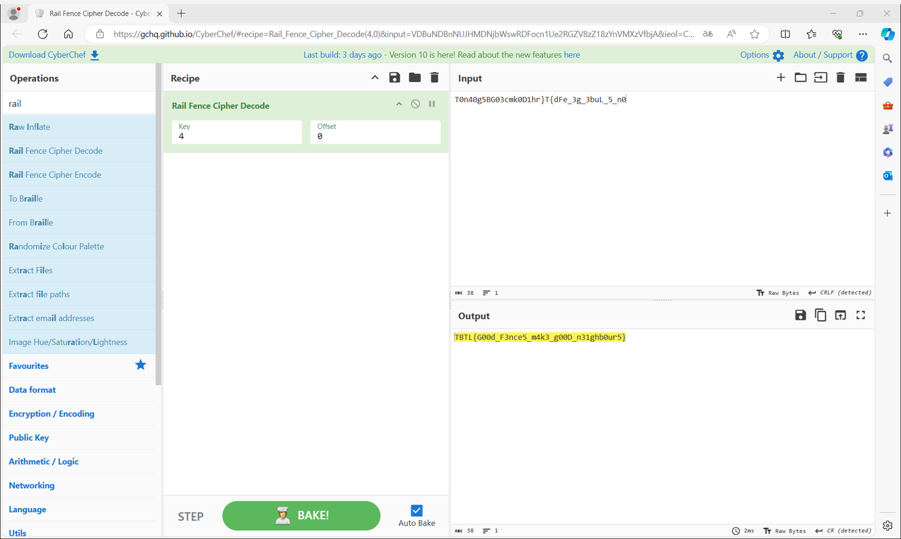

# My solution for FenceBuiling

問題文中で文字列が与えられている。
```
T0n40g5BG03cmk0D1hr}T{dFe_3g_3buL_5_n0
```

暗号文の中に`TBTL{}`の文字が入っていることから、アナグラム（文字並べ替え）と推測できる。

しかし、どのような基準で並べ替えを行っているか見当がつかない……

問題文からして、Split-rail fenceに関連するような暗号化がなされていると予想する。

Split-rail fence 暗号で検索してみると、レールフェンス暗号というものが見つかる。

[暗号紹介：レールフェンス暗号・Redefence暗号 暗号の仕組みとその特徴｜あやしき下臈（げろう）](https://note.com/ayasiki_gerahu/n/nac665cb5f3c9)

とても面白い暗号化手法だった。

毎度おなじみ[CyberChef](https://gchq.github.io/CyberChef/)さんで復号を試みる。

流石CyberChefさん、レールフェンス暗号の暗号化/復号もできるようになっている。

RecipeとしてRail_Fence_Cipher_Decodeを選択する。

Key = 4とすると[復号できた](https://gchq.github.io/CyberChef/#recipe=Rail_Fence_Cipher_Decode(4,0)&input=VDBuNDBnNUJHMDNjbWswRDFocn1Ue2RGZV8zZ18zYnVMXzVfbjA&ieol=CRLF&oeol=CR)。


```
TBTL{G00d_F3nce5_m4k3_g00D_n31ghb0ur5}
```

# 別解

プログラムで復号することもできる。

参考：[picoCTF2022 #Python - Qiita](https://qiita.com/motimotipurinn/items/776afed34512f64d77c2)

[ソルバー](./solve.c)を実行すると、3行目（Key = 4）でFlagが出力される。
```
$ python solve.py
T}0Tn{4d0Fge5_B3Gg0_33cbmukL0_D51_hnr0
T33c0mbkn0uD41Lh0r_}gT5{5d_FBen_G30g0_
TBTL{G00d_F3nce5_m4k3_g00D_n31ghb0ur5}
Tg0F_eD50B1_53hGn0rg__}34cT3nb{m0kdu0L
T0cr35g}mg05kT__3{0BnGDdbnuF1043heL0__
T0chF3_bermg05k}_unL3T0BnGD{g_05_d1043
T4GkrF3_be}0000g3DT_unL3{1c5nBmhdg_05_
T4GkrF_Ln_3e}0000g3DT_b50_u3{1c5nBmhdg
T4Gm1Te_Ln_3_{hk000g30rd3b50_ugF}Dc5nB
TngGm1Te_Ln_3_{hk05400B30rd3b50_ugF}Dc
TngGc0hTe_Ln_3_{rDm05400B3k1}d3b50_ugF
TngGc0hTF33Ln_bge{rDm05400B3k1}d__u50_
TngGc0hTF33L_0n_bge{rDm05400B3k1}d__u5
TngGc0hTF33u__0n5Lbge{rDm05400B3k1}d__
TngGc0hTF_g3u__0n5Lb_3e{rDm05400B3k1}d
TngGc0h}{F_g3u__0n5Lb_3edTrDm05400B3k1
TngGckDh}{F_g3u__0n5Lb_3edTr10m05400B3
TngB0ckDh}{F_g3u__0n5Lb_3edTr10m3G5400
T04gB0ckDh}{F_g3u__0n5Lb_3edTr10m3G50n
T0n4gB0ckDh}{F_g3u__0n5Lb_3edTr10m3G50
T0n40gB0ckDh}{F_g3u__0n5Lb_3edTr10m3G5
T0n40g5B0ckDh}{F_g3u__0n5Lb_3edTr10m3G
T0n40g5BG0ckDh}{F_g3u__0n5Lb_3edTr10m3
T0n40g5BG03ckDh}{F_g3u__0n5Lb_3edTr10m
T0n40g5BG03cmkDh}{F_g3u__0n5Lb_3edTr10
T0n40g5BG03cmk0Dh}{F_g3u__0n5Lb_3edTr1
T0n40g5BG03cmk0D1h}{F_g3u__0n5Lb_3edTr
T0n40g5BG03cmk0D1hr}{F_g3u__0n5Lb_3edT
T0n40g5BG03cmk0D1hr}T{F_g3u__0n5Lb_3ed
T0n40g5BG03cmk0D1hr}T{dF_g3u__0n5Lb_3e
T0n40g5BG03cmk0D1hr}T{dFe_g3u__0n5Lb_3
T0n40g5BG03cmk0D1hr}T{dFe_3g3u__0n5Lb_
T0n40g5BG03cmk0D1hr}T{dFe_3g_3u__0n5Lb
T0n40g5BG03cmk0D1hr}T{dFe_3g_3bu__0n5L
T0n40g5BG03cmk0D1hr}T{dFe_3g_3buL__0n5
T0n40g5BG03cmk0D1hr}T{dFe_3g_3buL_5_0n
```
