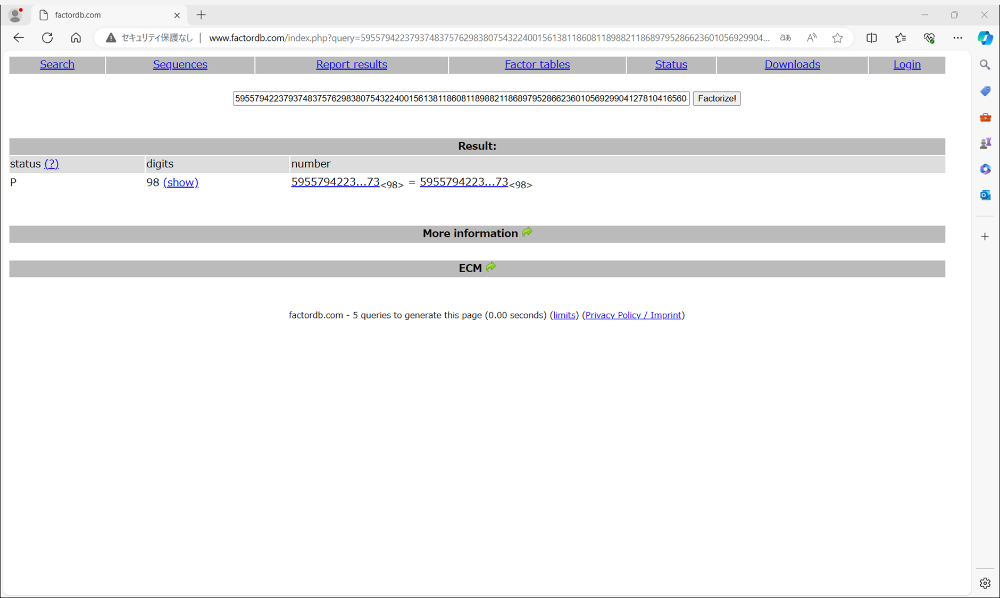

# My solution for SchoolEssay

[暗号化に使われたファイル](../given_files/chall.py)と[その出力結果を記したテキストファイル](../given_files/description.txt)が与えられる。

暗号化に使われたファイルを眺めたり動かしたりすると、以下のことが分かる
- invpow3は入力された数値の3乗根を整数値で返す関数
    - 例：
        - invpow3(7) = 1
        - invpow3(8) = 2
        - invpow3(9) = 2
- 処理結果として、法`N`、`value_1 = (name_int ** 2) % N`、`value_2 = invpow3(name_int ** 2)`が与えられる

また、[factordb](http://www.factordb.com/)を用いると`N`が素数であることが分かる。



よって、`value2`から`name_int ** 2`の下限が分かるので、その下限以上かつ法`N`上で`value1`と合同な値を求め、その値の法`N`上における平方根を求めれば良さそう。

法`N`上での平方根を求めるには、`N = 1 (mod 4)`よりTonelli-Shanksアルゴリズムを用いれば良さそう。

参考：[平方剰余を理解したい](https://zenn.dev/mahiro33/articles/6d30aeafe16c70)

Pythonで[ソルバー](./solve.c)を作成し、実行してフラグを獲得できた。

```
> python .\solve.py
b'\x1b\x8d\xd0\x93\xc6\xb4\x11e\x12z\x98\xe9\xac\x99\x8d\xa5\xa4Vd\xbe[\xbe\xb9\xc2\xd2[\xdaN\x95l\xbc\xeffh\xdd\x1f\xbb-\xfa\xa9`'
b'TBTL{J0hn_J4c0b_J1n6leH31mer_Schm1d7_<3}'
```

```
TBTL{J0hn_J4c0b_J1n6leH31mer_Schm1d7_<3}
```
