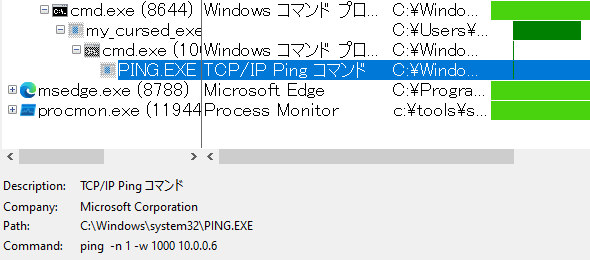
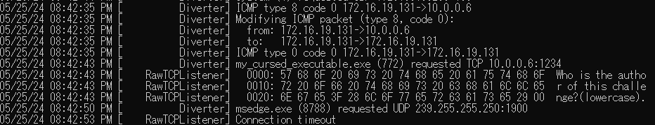
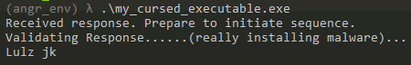
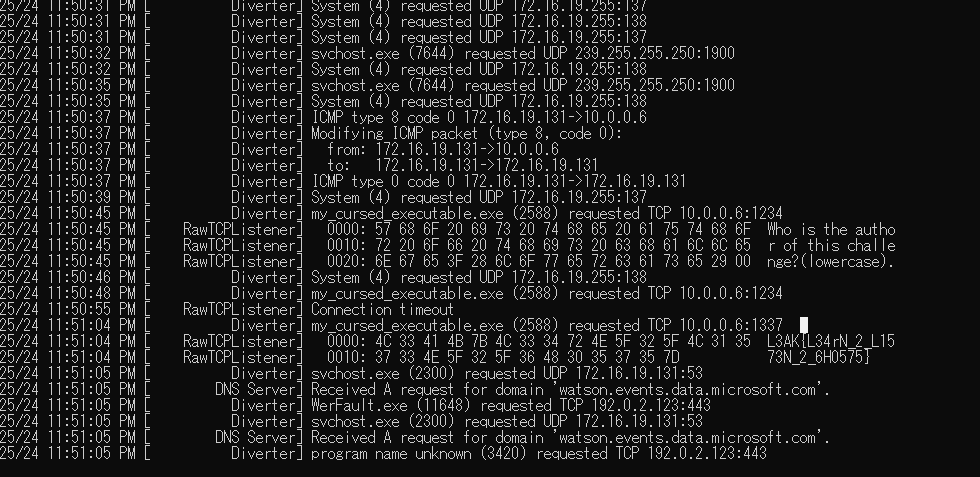
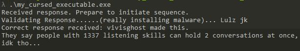

# My solution for Do_It_Dynamically

環境：Windows 10 VM

配布されるzipを解凍すると、PEファイル(`my_cursed_executable.exe`) が得られる。

問題文から、動的解析をして解く問題だと推測できる。まず初めに、[FAKENET-NG](https://github.com/mandiant/flare-fakenet-ng) と [Process Monitor](https://learn.microsoft.com/en-us/sysinternals/downloads/procmon) を立ち上げ、問題ファイルを実行した。FAKENET-NG を使用した理由は、もしかしたら外部との通信を行うかもしれず、手がかりが得られると思ったからである。

すると、Process Monitor の情報からは主に２つの情報が得られた。
- `10.0.0.6` にネットワーク疎通を行っている。(`ping  -n 1 -w 1000 10.0.0.6` )
- `CreateFile` によって、`fake_flag.txt` が問題ファイルと同ディレクトリに生成される。

また、FAKENETのログには`10.0.0.6`へのTCP通信が記録されており、`Who is the author of this challenge?` というメッセージが送信されていることがわかる。コンソール画面には、何かしらのレスポンスを受け取って検証をしているような旨が出力されている。

これらの情報から、問題ファイルは次の処理を行っていると推測した。
- `10.0.0.6` に通信を行い、レスポンスを受け取る。
- レスポンス内容を検証する。
- レスポンス内容が間違っていれば、`fake_flag.txt` を生成する。レスポンス内容が正しければ、FLAG を生成する。

TCPで送られているメッセージは`Who is the author of this challenge?` であることから、`10.0.0.6` から問題の作者である`vivisghost` をレスポンスとして送ることができれば、フラグが求まりそうである。

FAKENETにおけるカスタムレスポンスのやり方を調べたところ、[公式のドキュメント](https://cloud.google.com/blog/topics/threat-intelligence/improving-dynamic-malware-analysis-with-cheat-codes-for-fakenet-ng?hl=en#:~:text=handle%20this%20scenario.-,Static%20Custom%20Response,-You%20can%20configure) を見つけた。FAKENETでは、静的なカスタムレスポンスを設定することができる。手順に従って`vivisghost` をレスポンスとする`RawTCPListener` を実装し、問題ファイルを実行するとフラグがログに出力された。

`L3AK{L34rN_2_L1573N_2_6H0575}`