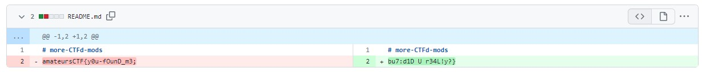

# My solution for Gitint_5e
## 解答
問題文を日本語に訳すとこうだ：
>  les-amateursのレポジトリの1つがちょっと怪しいです。そのリポジトリにある本当のフラグをすべて見つけて、報告してもらえますか？全部で3つのフラグがあり、そのうち1つは0ポイントの価値があります。このチャレンジでは、sha256ハッシュ5e60b82a7b0860b53b6f100f599a5e04d52faf1a556ea78578e594af2e2ccf7cのフラグを提出してください。

まず作問者の `hellopir2` で検索すると[GitHub](https://github.com/hellopir2) が見つかる。さらに hellopir2 のリポジトリを見てみると、問題文に書かれている les-amateurs の[GitHub](https://github.com/les-amateurs) も見つかる。 les-amateursのリポジトリのうち、比較的更新が新しいリポジトリを色々見てみると、[more-CTFd-mods](https://github.com/les-amateurs/more-CTFd-mods) というリポジトリが怪しそうであることが分かる。

作問者の心理的に、[古いコミットログ](https://github.com/les-amateurs/more-CTFd-mods/commit/6b021f34ac009700d9239d64ac3b7b0ec2693eff) にフラグの情報を隠しているのでは、とアタリを付けて見てみるとビンゴである：



与えられたsha256値と一致するかチェックしておく：
```console
$ echo -n 'amateursCTF{y0u-fOunD_m3;bu7:d1D U r34L!y?}' | sha256sum
5e60b82a7b0860b53b6f100f599a5e04d52faf1a556ea78578e594af2e2ccf7c  -
```
