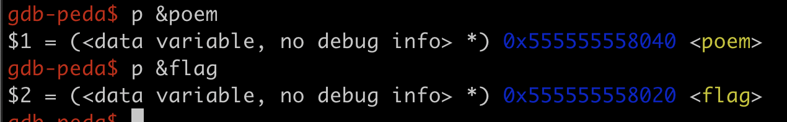
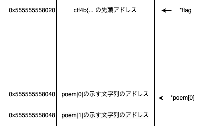

## 方針
まずコードを見るとマスクされたflagが書かれており、これを読み出すことが目的であると考えられる。

次にmain関数を見ると、入力を受付、そのインデックスのpoemを出力していることがわかる。出力に当たっては配列のサイズを超える5以上の整数の場合をチェックして、はじいている。
しかし、上限が定められている一方、負の値については制限されておらず、負の値を入れることで配列poemの配列外参照ができそう。

## 分析
以上の方針のように、負の値を入力して試してみると、案外すぐに見つかる。
しかし、ここでは正確に分析をしてみる。

ということで、配列外参照のヒントを得るため、2つのポインタ変数flagとpoemの番地を調べてみる。用いるツールはなんでも大体できると思うが、ここでは、gdbを用いた結果が以下の通り。
{: align="center"}

これをみると、poemの先頭番地とflagの番地の差は0x20バイトである。64bit = 8bytesであるから配列のインデックス1つ分が0x8bytesだから、0x20/0x8 = 4だけpoemを遡れば、その番地がflagのポインタ変数である。
{: align="center"}

## 解答
標準入力に対して、-4を入力すればok
