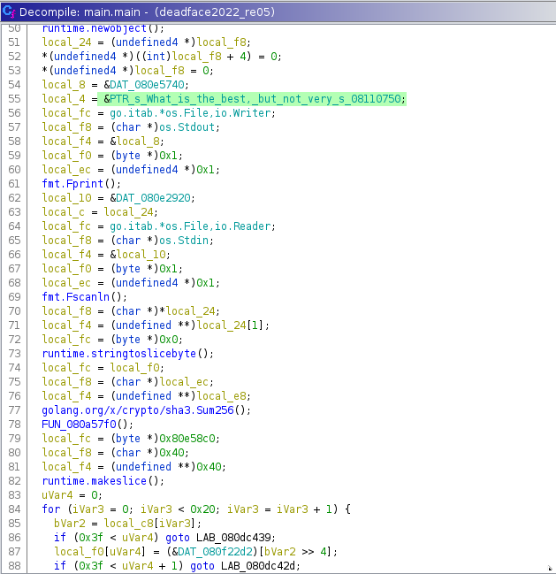
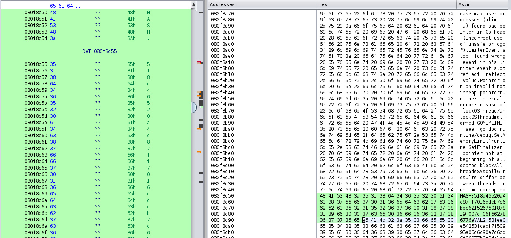
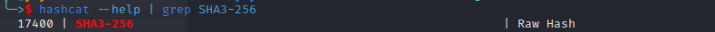
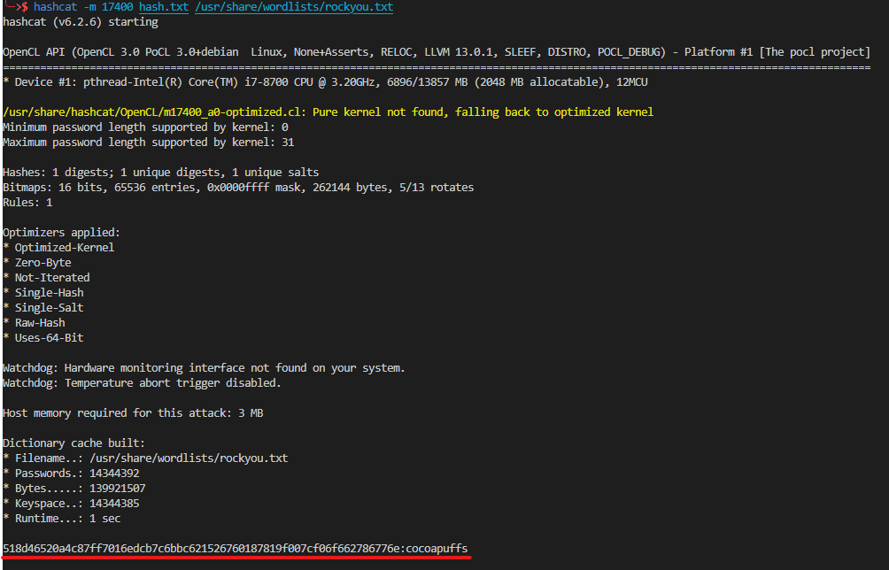
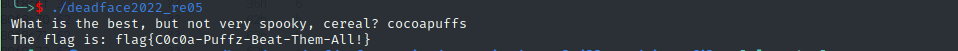

# Cereal Killer 01 (DEADFACE CTF 2022)
> mirveal doesn't like spooky cereals. He prefers something much more pedestrian, but thoroughly sugarful. Enter the answer as flag{here-is-the-answer}.  
> Choose either the Windows binary or the Linux binary, whichever you are most comfortable analyzing.  
> [Download Windows Binary](./given_files/deadface2022_re05.exe)
SHA1: 8e7c1dd9835c6206d952855401c87234b1a0f3b3  
> [Download Linux Binary](./given_files/deadface2022_re05)
SHA1: 826dfb91409caa6ce02f88a46f2d63715ff85f82

# Writeup
## 
[rabin2](https://r2wiki.readthedocs.io/en/latest/tools/rabin2/)でバイナリの情報を確認すると，go言語で書かれたELFとわかる．
<figure><figcaption></figcaption></figure>

> Goバイナリのリバースエンジニアリングは困難．
> (参考：[Reversing Golang Binaries with Ghidra](https://vblocalhost.com/uploads/2021/09/VB2021-04.pdf))

実行すると，質問を出力し回答の入力を受け付けるプログラムである．試しに"kellogg"を入力してみた．もしかしたら，正しい回答をするとフラグが得られるかも．．．
<figure><figcaption></figcaption></figure>

Ghidraで静的解析するが，その前に，[Goバイナリ用のGhidra Scripts](https://github.com/getCUJO/ThreatIntel/tree/master/Scripts/Ghidra)をインストールする．  
インストール後，スクリプトを使用して，main.mainを見やすくする．
<figure><figcaption></figcaption></figure>
実行したときの質問文らしきものが見つかるので，このfunctionを重点的に見ればよさそう．
ざっとみると，

1. fmt.Fprint()：質問文を出力 [61行目]
2. fmt.Fscanln()：入力文字列を得る [69行目]
3. runtime.stringtoslicebyte()：入力文字列をバイトに変換（？） [73行目]
4. 変換したバイト列を[sha3-256](https://ja.wikipedia.org/wiki/SHA-3)でハッシュ化（？)して，文字列に変換[77行目,95行目]
5. ハッシュ化した文字列が64文字であれば[96行目]，runtime.memequal()でメモリに格納されている文字列と比較 [100行目]

比較先のDAT_080f8c55を調べる．(Ghidraではダブルクリックすると，Listing Viewでアドレスに飛べる)  
明らかハッシュである文字列が見つかった．（画像の右半分はBytes Viewで，HexとAscii Viewを表示）
<figure><figcaption></figcaption></figure>

ここまでのプログラムの流れを簡単に説明すると，
(入力文字列をsha3-256でハッシュ化した文字列) = (518d46520a4c87ff7016edcb7c6bbc621526760187819f007cf06f662786776e)であるか比較している．

518d46520a4c87ff7016edcb7c6bbc621526760187819f007cf06f662786776e を逆変換すれば正しい入力文字列が得られるが，容易ではない．
 > ハッシュ値から、そのようなハッシュ値となる文字列を得ることは（事実上）不可能である．（原像計算困難性、弱衝突耐性)  
 参考：[暗号学的ハッシュ関数](https://ja.wikipedia.org/wiki/%E6%9A%97%E5%8F%B7%E5%AD%A6%E7%9A%84%E3%83%8F%E3%83%83%E3%82%B7%E3%83%A5%E9%96%A2%E6%95%B0)

 ハッシュ，[Hashcat](https://hashcat.net/hashcat/)というパスワードクラッカーを使えば，復元できる場合がある．  
 hashcatの使い方は，以下の通りで，今回の場合は**ハッシュ値**と**辞書**を指定し，辞書攻撃を行う．  
 辞書は[rockyou.txt](https://github.com/brannondorsey/naive-hashcat/releases/download/data/rockyou.txt)を用いることが多いらしい．
~~~
Usage: hashcat [options]... hash|hashfile|hccapxfile [dictionary|mask|directory]...
~~~

オプション -mで指定するHash-typeを調べる．
<figure><figcaption></figcaption></figure>

ダウンロードした[rockyou.txt](https://github.com/brannondorsey/naive-hashcat/releases/download/data/rockyou.txt)を用いて辞書攻撃を行うと，
~~~
echo 518d46520a4c87ff7016edcb7c6bbc621526760187819f007cf06f662786776e > hash.txt
sudo hashcat -m 17400 hash.txt /usr/share/wordlists/rockyou.txt
~~~
<figure><figcaption></figcaption></figure>

パスワードは **cocoapuffs** であるとことがわかった．
<figure><figcaption></figcaption></figure>