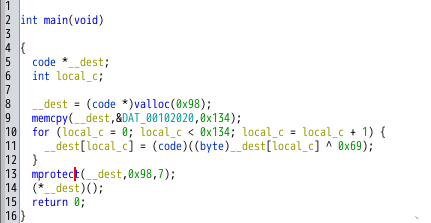
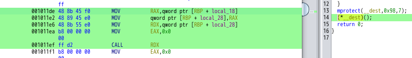
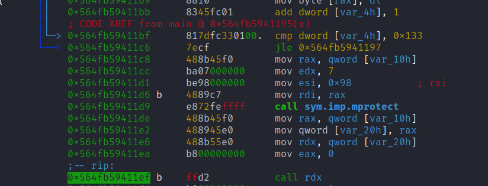
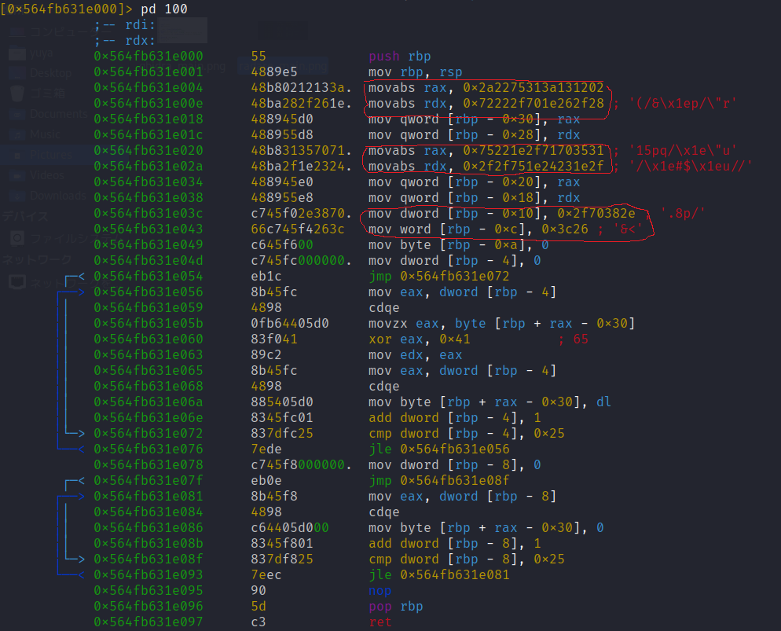

# My solution for SHELLCODE-CEPTION
`shellcode-ception` というバイナリが与えられる．
```
$ file shellcode-ception                                                                                                
shellcode-ception: ELF 64-bit LSB pie executable, x86-64, version 1 (SYSV), dynamically linked, interpreter /lib64/ld-linux-x86-64.so.2, for GNU/Linux 3.2.0, BuildID[sha1]=cb0b2b8de9e82504d1673ed64af249faf12403a6, stripped
```
## 静的解析 (Ghidra)
ストリップされているので，Ghidra は `main関数`を教えてくれないが，`entry` 内の`__libc_start_main` の第一引数を見ればすぐに特定できる．

<figure></figure>

`main関数`の処理を追うと，
- `DAT_00102020` に格納されている値を `0x69` でxorし，`__dest 配列`に格納
- `(*__dest)();` で関数ポインタ`__dest` を呼び出す

ということをしている．  
`(*__dest)();` に対応するアセンブラをみると，わかりやすい．

<figure></figure>

`CALL RDX` で `RDX` がさすアドレスに処理が移っていることがわかるが，静的解析で `RDX` の値を求めることは少し面倒であるため，動的解析を用いる．

## 動的解析 (radare2)
`radare2` で `CALL RDX` にブレイクポイントをはり，`RDX` の値を求める．
<figure></figure>

```
[0x564fb59411c6]> dr rdx
0x564fb631e000
```

`rdx = 0x564fb631e000` であることが分かったので，アドレス `0x564fb631e000` にシークし，その先の逆アセンブル結果を見てみる．

```
[0x564fb59411c6]> s 0x564fb631e000
[0x564fb631e000]> pd 100
```

<figure></figure>

すると，`push` から始まり，`ret` で終わる関数のようなアセンブラが見つかる．さらに，怪しいバイト列が複数あることも確認できる．（怪しいバイト列を赤で囲んだ）

どうやら，`38 バイト` のバイト列を `rbp` がさすメモリに格納しているようである．その後，`0x25 + 1` 回ループがまわり，さきほどのバイト列と `0x41` をXORしている．

そこで，怪しい 38 バイトのバイト列と `0x41` を手元でXORするスクリプトを書いてみた．
ただし，リトルエンディアンに注意する．

```Python
s = 0x0212133a3175222a282f261e702f2272313570712f1e22752f1e23241e752f2f2e38702f263c
# 2バイトずつ，リストに格納
byte_list = []
while s > 0:
    byte = s & 0xFF
    byte_list.append(byte)
    s >>= 8
byte_list.reverse()

# 0x41でXOR
flag = "".join(chr(l ^ 0x41) for l in byte_list)

print(flag)
```
すると，フラグが得られる．
```
CSR{p4cking_1nc3pt10n_c4n_be_4nnoy1ng}
```

# Further study
`r2pipe` を用いることで，radare2 の処理を自動化することができる．

`0x41` でXORした直後にブレイクポイントを張り，38回実行を止め，その都度 `eax` の値を取得することで，フラグを求めることができると考えた．

ただし，radare2 をデバッガーモードで起動すると，仮想アドレスがその都度変わってしまうので，工夫する必要がある．

今回は，`r2pipe` でスクリプトを書く前に，ブレイクポイントを張るところのオフセットを求めておくことで対応した．

ブレイクポイントを張るべき箇所は２つである．

1. `call rdx`
2. `xor eax, 0x41` の直後の `mov edx, eax`

1 へのオフセットは，`[call rdx] - [entryポイント = vaddr]` で求めることができる．2 へのオフセットは，`[mov edx, eax] - [call rdx]` で求めることができる．

これらを元に [ソルバー](./r2-solve.py) を作成した．実行すると，フラグが求まる．

