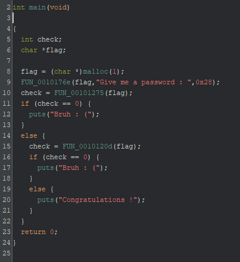
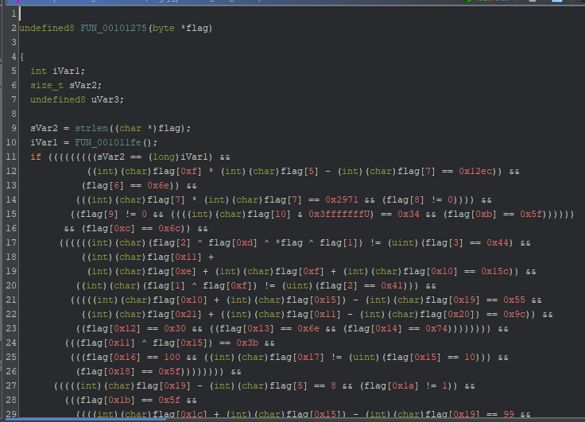

# My solution for Angry

名前からして `angr` に関係していると推測できる。Ghidraでmain関数を解析すると、次のことがわかる。

- Congratulations ! が出力されるような入力文字列がフラグ
  - `FUN_00101275` や `FUN_0010120d` のチェックをパスしないといけない



`FUN_00101275` を見ると、明らかに制約条件がある。これらのすべての条件をパスできるような入力文字列を求める必要がある。



`Z3` などのソルバーで求めるような問題だと推測できるが、とりあえず `angr` を試す。（angr は内部でZ3をソルバーとして使っている）

```python
import angr
import claripy
from logging import getLogger, WARN
getLogger("angr").setLevel(WARN + 1)

p = angr.Project("./angry_patched_skill_issues")
state = p.factory.entry_state()
simgr = p.factory.simulation_manager(state)

simgr.explore(find=lambda s: b"Congratulations !" in s.posix.dumps(1),
    avoid=lambda s: b"Bruh : (" in s.posix.dumps(1))
try:
  found = simgr.found[0]
  print("flag:", found.posix.dumps(0))
except IndexError:
  print("flag not found")
```

すると、ほとんどの文字列は求まるが、一部が求まっていないという実行結果になった。

`flag: b'>3A\x01\x01angr_4_l\x7ff3_d0nt_do_i\x02_m4nU4lly}\x00\x00'`

実は、この問題は**作問ミス**であり、意味の通るリート文字列を推測する必要があった。最終的なフラグは、`L3AK{angr_4_l1f3_d0nt_do_it_m4nU4lly}` である。

本来、この問題は `angr` や `z3` などを使うと、自動的にフラグが求めることができるという意図だったようである。