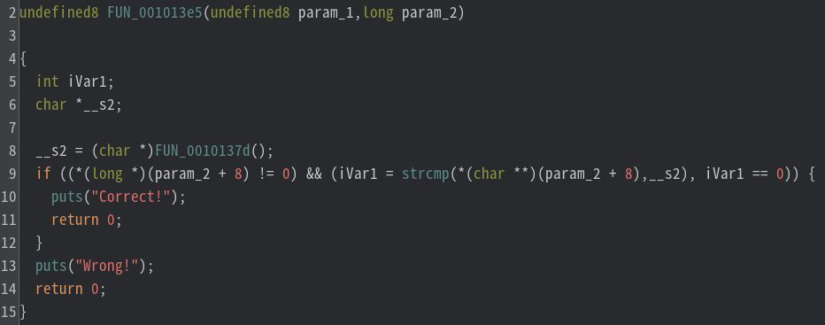
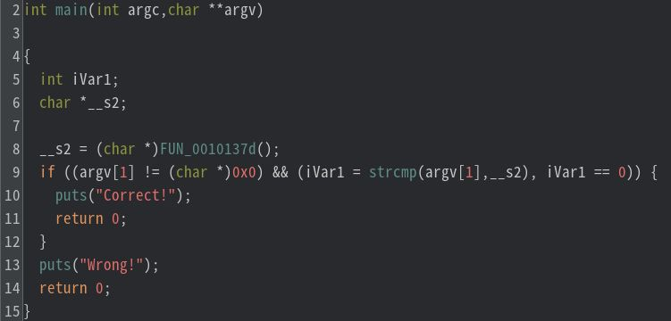

# My solution for Hidden

シンボル情報が消されたELFファイル `hidden` が配布される。`strings` をしても、FLAGは求まらない。ただし、`Correct!` と `Wrong!` は見えるので、フラグチェッカーだろうと推測できる。

```
$ file hidden 
hidden: ELF 64-bit LSB pie executable, x86-64, version 1 (SYSV), dynamically linked, interpreter /lib64/ld-linux-x86-64.so.2, BuildID[sha1]=beccc3d02eff9ba84fecaa5a02b69c00b4f59bac, for GNU/Linux 3.2.0, stripped 
```

```
$ strings -d hidden 
/lib64/ld-linux-x86-64.so.2
__cxa_finalize
malloc
__libc_start_main
strcmp
puts
strlen
__stack_chk_fail
libc.so.6
GLIBC_2.4
GLIBC_2.2.5
GLIBC_2.34
_ITM_deregisterTMCloneTable
__gmon_start__
_ITM_registerTMCloneTable
PTE1
u+UH
/w#H
/w#H
j}jsjPj3jTjsj_jyjbj4jbA
Correct!
Wrong!
:*3$"
```

Ghidraで静的解析を行う。ストリップ（シンボル情報が消去）されているが、`__libc_start_main` の第一引数からmain関数(0x001013e5)は特定できる。main関数を眺めると、第２引数(param_2)に関する処理があり、バイナリ実行時のコマンドライン引数が重要だとわかる。



Ghidraの`EditFuntion Signature` により、`undefined8 param_1` を `int argc` に、`long param_2` を `char ** argv` に変更すると、かなり逆コンパイル結果が見やすくなる。



重要なのは、以下の部分である。`Correct!` を出力させるためには、バイナリ実行時の一つめの引数が `__s2` と一致している必要がある。`__s2` が何かというと、`FUN_0010137d` である。つまり、求めたいフラグは `FUN_0010137d` の戻り値である。よって、デバッガで`FUN_0010137d` の実行直後にブレイクポイントをセットし、`__s2` の値を見れば、フラグが求まると推測できる。

```c
__s2 = (char *)FUN_0010137d();
if ((argv[1] != (char *)0x0) && (iVar1 = strcmp(argv[1],__s2), iVar1 == 0)) {
  puts("Correct!");
  return 0;
}
```

デバッガは何でもいいが、radare2 を用いる。`call fcn.0000137d` の直後である `0x00001402` にブレイクポイントをセットし、関数の戻り値である `rax` の指すメモリの内容をみればよい。

```
$ r2 -A hidden
[0x000010e0]> s main
[0x000013e5]> pdf
            ; DATA XREF from entry0 @ 0x10f8(r)
┌ 118: int main (int argc, char **argv);
│           ; arg int argc @ rdi
│           ; arg char **argv @ rsi
│           ; var char *s2 @ rbp-0x8
│           ; var int64_t var_14h @ rbp-0x14
│           ; var char **s1 @ rbp-0x20
│           0x000013e5      f30f1efa       endbr64
│           0x000013e9      55             push rbp
│           0x000013ea      4889e5         mov rbp, rsp
│           0x000013ed      4883ec20       sub rsp, 0x20
│           0x000013f1      897dec         mov dword [var_14h], edi    ; argc
│           0x000013f4      488975e0       mov qword [s1], rsi         ; argv
│           0x000013f8      b800000000     mov eax, 0
│           0x000013fd      e87bffffff     call fcn.0000137d
│           0x00001402      488945f8       mov qword [s2], rax
│           0x00001406      488b45e0       mov rax, qword [s1]
│           0x0000140a      4883c008       add rax, 8
│           0x0000140e      488b00         mov rax, qword [rax]
│           0x00001411      4885c0         test rax, rax
│       ┌─< 0x00001414      742f           je 0x1445
│       │   0x00001416      488b45e0       mov rax, qword [s1]
│       │   0x0000141a      4883c008       add rax, 8
│       │   0x0000141e      488b00         mov rax, qword [rax]
│       │   0x00001421      488b55f8       mov rdx, qword [s2]
│       │   0x00001425      4889d6         mov rsi, rdx                ; const char *s2
│       │   0x00001428      4889c7         mov rdi, rax                ; const char *s1
│       │   0x0000142b      e890fcffff     call sym.imp.strcmp         ; int strcmp(const char *s1, const char *s2)
│       │   0x00001430      85c0           test eax, eax
│      ┌──< 0x00001432      7511           jne 0x1445
│      ││   0x00001434      488d05c90b..   lea rax, str.Correct_       ; 0x2004 ; "Correct!"
│      ││   0x0000143b      4889c7         mov rdi, rax                ; const char *s
│      ││   0x0000143e      e84dfcffff     call sym.imp.puts           ; int puts(const char *s)
│     ┌───< 0x00001443      eb0f           jmp 0x1454
│     │││   ; CODE XREFS from main @ 0x1414(x), 0x1432(x)
│     │└└─> 0x00001445      488d05c10b..   lea rax, str.Wrong_         ; 0x200d ; "Wrong!"
│     │     0x0000144c      4889c7         mov rdi, rax                ; const char *s
│     │     0x0000144f      e83cfcffff     call sym.imp.puts           ; int puts(const char *s)
│     │     ; CODE XREF from main @ 0x1443(x)
│     └───> 0x00001454      b800000000     mov eax, 0
│           0x00001459      c9             leave
└           0x0000145a      c3             ret

```
以下のradare2 コマンドを実行すると、フラグが求まる。
- `db 0x00001402` : `0x00001402` にブレイクポイントをセットする
- `ood` : デバッグモードで同じファイルを再度開く（このとき、ブレイクポイントなどの情報は引き継がれる）
- `dc` : 実行
- `px @rax (px--1 @rax)` :  raxの値をアドレスと解釈し、そのアドレスをダンプする  
```
[0x000013e5]> db 0x00001402
[0x000013e5]> ood
[0x7f86ff2a7290]> dc
INFO: hit breakpoint at: 0x55ca68b3d402
[0x55ca68b3d402]> px--1 @rax
- offset -      9091 9293 9495 9697 9899 9A9B 9C9D 9E9F  0123456789ABCDEF
0x55ca6a4da290  0000 0000 0000 0000 1102 0000 0000 0000  ................                                                     
0x55ca6a4da2a0  4c33 414b 7b62 3462 795f 7354 3350 737d  L3AK{b4by_sT3Ps}
0x55ca6a4da2b0  0000 0000 0000 0000 0000 0000 0000 0000  ................
```
`L3AK{b4by_sT3Ps}`

