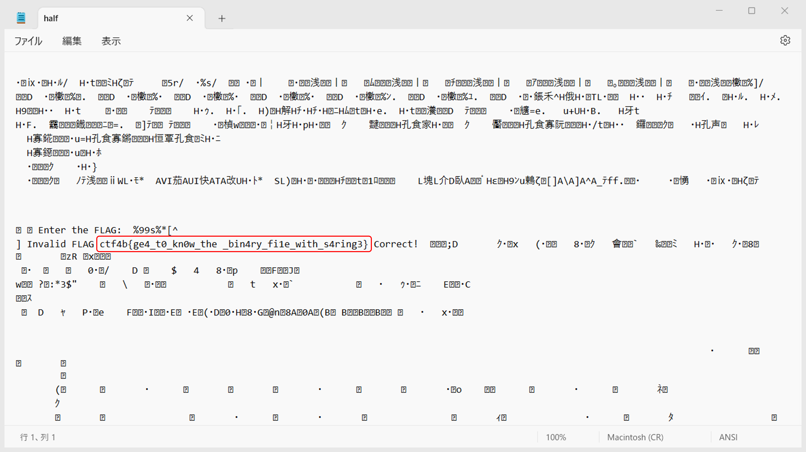

# My solution of Half

`half` というバイナリが与えれている．

`strings` コマンドで`just_password` 内の印字可能な文字列 (ASCII文字列) を表示してみる．
`-d` オプションをつけることで，データセクション内の文字列だけを表示できる．
```
strings -d half
```
`strings` するとFLAGが見つかる．
```
/lib64/ld-linux-x86-64.so.2
libc.so.6
strncmp
__isoc99_scanf
puts
printf
strlen
__cxa_finalize
strcmp
__libc_start_main
GLIBC_2.7
GLIBC_2.2.5
_ITM_deregisterTMCloneTable
__gmon_start__
_ITM_registerTMCloneTable
u+UH
[]A\A]A^A_
Enter the FLAG:
%99s%*[^
Invalid FLAG
ctf4b{ge4_t0_kn0w_the
_bin4ry_fi1e_with_s4ring3}
Correct!
:*3$"
```

`ctf4b{ge4_t0_kn0w_the_bin4ry_fi1e_with_s4ring3}`

# 別解
halfを選択し，「プログラムから開く」→「メモ帳」からメモ帳アプリで開いてもFLAGが見つかる．

<figure></figure>
