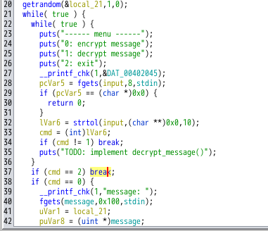
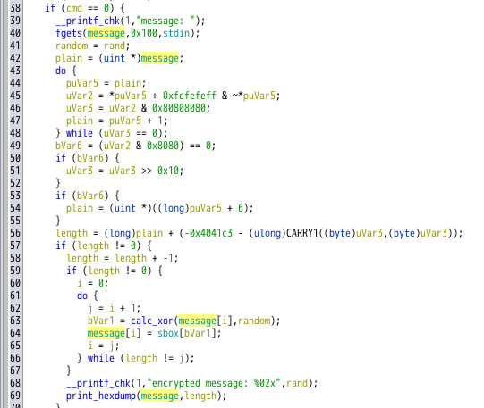

# My solution of Heaven
2つのファイルが与えられる．
- `heaven` : binary
- `log.txt` : text
```
$ file *
heaven:        ELF 64-bit LSB executable, x86-64, version 1 (SYSV), dynamically linked, interpreter /lib64/ld-linux-x86-64.so.2, BuildID[sha1]=3a99242dfe286c6f548dc4e4af2763ffedee54cf, for GNU/Linux 3.2.0, not stripped
log.txt:       ASCII text
```

`log.txt` の中身は，`heaven` を実行し `フラグ` を暗号化したときのプロンプトのようである．

もちろん，`フラグ` の中身は隠されている．
```
-> $ cat log.txt                                                                                                                      
$ ./heaven
------ menu ------
0: encrypt message
1: decrypt message
2: exit
> 0
message: ctf4b{---CENSORED---}
encrypted message: ca6ae6e83d63c90bed34a8be8a0bfd3ded34f25034ec508ae8ec0b7f
```

`heaven` を実行し適当な文字列を暗号化してみるが，あまり手がかりは得られない．

```
$ ./heaven                                                                                                                           
------ menu ------
0: encrypt message
1: decrypt message
2: exit
> 0 
message: ctf4b{abcedfg}
encrypted message: a0b183d7c7f4a526f4b18616d770ab
```

## Ghidra
暗号化処理を解読する．

<figure></figure>

`main関数` をみると，入力した `コマンド` によって処理が分岐していることが容易に分かる．

暗号化を行っている `cmd == 0` の
ときの分岐に注目する．

<figure></figure>

`message` の暗号化は，57行目 ~ 67行目で行われている．

Ghidra は，`calc_xor` の逆コンパイルに失敗している．
とりあえず，`calc_xor` はデフォルトの `xor` だと想定し，処理を追う．

暗号化は以下の手順だと推測した．
- 20行目で生成した1バイトの乱数 `random` と `message[i]`の `xor` をとる．( -> `bVar1`) 
- `message[i]` に `sbox[bvar1]` を代入
- 上記の手順を `message` のすべてのインデックス `i` に対して行う．

`sbox`配列は Ghidra で解析できているので，後は `random` が分かれば解ける．

実は，68行目をみると，`encrypted message: ` の後に乱数 `random` が出力されてしまっている．`log.txt` の内容から，乱数は `ca` であるとわかる．

よって，`xor` の性質より，逆の処理をすればフラグは求まるので，ソルバーを書く．

```Python
sbox = [0xc2, 0x53, 0xbb, 0x80, 0x2e, 0x5f, 0x1e, 0xb5, 0x17, 0x11, 0x00, 0x9e, 0x24, 0xc5, 0xcd, 0xd2, 0x7e, 0x39, 0xc6, 0x1a, 0x41, 0x52, 0xa9, 0x99, 0x03, 0x69, 0x8b, 0x73, 0x6f, 0xa0, 0xf1, 0xd8, 0xf5, 0x43, 0x7d, 0x0e, 0x19, 0x94, 0xb9, 0x36, 0x7b, 0x30, 0x25, 0x18, 0x02, 0xa7, 0xdb, 0xb3, 0x90, 0x98, 0x74, 0xaa, 0xa3, 0x20, 0xea, 0x72, 0xa2, 0x8e, 0x14, 0x5b, 0x23, 0x96, 0x62, 0xa4, 0x46, 0x22, 0x65, 0x7a, 0x08, 0xf6, 0x12, 0xac, 0x44, 0xe9, 0x28, 0x8d, 0xfe, 0x84, 0xc3, 0xe3, 0xfb, 0x15, 0x91, 0x3a, 0x8f, 0x56, 0xeb, 0x33, 0x6d, 0x0a, 0x31, 0x27, 0x54, 0xf9, 0x4a, 0xf3, 0xbf, 0x4b, 0xda, 0x68, 0xa1, 0x3c, 0xff, 0x38, 0xa6, 0x3e, 0xb7, 0xc0, 0x9a, 0x35, 0xca, 0x09, 0xb8, 0x8c, 0xde, 0x1c, 0x0c, 0x32, 0x2a, 0x0f, 0x82, 0xad, 0x64, 0x45, 0x85, 0xd1, 0xaf, 0xd9, 0xfc, 0xb4, 0x29, 0x01, 0x9b, 0x60, 0x75, 0xce, 0x4f, 0xc8, 0xcc, 0xe2, 0xe4, 0xf7, 0xd4, 0x04, 0x67, 0x92, 0xe5, 0xc7, 0x34, 0x0d, 0xf0, 0x93, 0x2c, 0xd5, 0xdd, 0x13, 0x95, 0x81, 0x88, 0x47, 0x9d, 0x0b, 0x1f, 0x5e, 0x5d, 0xa8, 0xe7, 0x05, 0x6a, 0xed, 0x2b, 0x63, 0x2f, 0x4c, 0xcb, 0xe8, 0xc9, 0x5a, 0xdc, 0xc4, 0xb0, 0xe1, 0x7f, 0x9f, 0x06, 0xe6, 0x57, 0xbe, 0xbd, 0xc1, 0xec, 0x59, 0x26, 0xf4, 0xb1, 0x16, 0x86, 0xd7, 0x70, 0x37, 0x4d, 0x71, 0x77, 0xdf, 0xba, 0xf8, 0x3b, 0x55, 0x9c, 0x79, 0x07, 0x83, 0x97, 0xd6, 0x6e, 0x61, 0x1d, 0x1b, 0xa5, 0x40, 0xab, 0xbc, 0x6b, 0x89, 0xae, 0x51, 0x78, 0xb6, 0xb2, 0xfd, 0xfa, 0xd3, 0x87, 0xef, 0xee, 0xe0, 0x2d, 0x4e, 0x3f, 0x6c, 0x66, 0x5c, 0x7c, 0x10, 0xcf, 0x49, 0x48, 0x21, 0x8a, 0x3d, 0xf2, 0x76, 0xd0, 0x42, 0x50, 0x58, 0x00 ]

hex_string = "6ae6e83d63c90bed34a8be8a0bfd3ded34f25034ec508ae8ec0b7f"
xor_byte = 0xca

# 暗号文を2バイトづつのリストに変換
message = [int(hex_string[i:i+2], 16) for i in range(0, len(hex_string), 2)]

# sbox と 暗号文のインデックスの対応表
indexes = [sbox.index(byte) for byte in message]

# calc_xor の逆処理
origin_message = [index^xor_byte for index in indexes]

flag_str = ''.join(chr(i) for i in origin_message)

print(flag_str)
```
実行すると，`bse3azkc^oq2k/3c^04^t42etk|` が得られるが，フラグではない．

よく見ると，`bse3a` は `ctf4b` の一文字ずれであることが分かる．（チームメンバーが気づいてくれた）

`calc_xor` はただの `xor` ではなかったようだ．

正しい[ソルバー](../solve/solve.py)を実行すると，フラグが求まる．
```
$ python3 solve.py                                                                           
ctf4b{ld_pr3l04d_15_u53ful}
```

# Further study
[他の人のWriteup](https://tan.hatenadiary.jp/entry/2023/06/05/001017#reversing-hard-Heaven-47-team-solved-140-points) を読んでいると，フラグの文字列から想定解は `SOファイルのpreload` のようである．

そこで，想定解(？)も試してみる．

soのpreload について，GPT に聞いてみると，
>プリロードは、プログラムが実行される前に、特定の共有オブジェクトをロードするメカニズムです。プリロードを使用すると、プログラムが実行される際に、指定した共有オブジェクトが事前にメモリに読み込まれ、実行時にシステムが自動的にそれらの共有オブジェクトを使用します。
> 一般的な使用例としては、環境変数LD_PRELOADを使用して、特定の共有オブジェクトをプリロードすることがあります。これにより、プリロードされた共有オブジェクトが通常のライブラリの前に読み込まれ、プログラムの振る舞いを変更することができます。プリロードは、ライブラリの関数を置き換えたり、ラッパー関数を提供したりするために使用されることがあります。

と教えてくれた．

`getrandom` のプリロード用の共有オブジェクトを作成するために，
固定値 `202 (0xca)` をバッファに書き込む `getrandom関数` を実装した [preload.c](../solve/preload.c) を書く．

```C
#define _GNU_SOURCE
#include <unistd.h>
#include <sys/syscall.h>

ssize_t getrandom(void *buf, size_t buflen, unsigned int flags) {
    memset(buf, 202, buflen);
    return buflen;
}
```

次に，コンパイルし共有オブジェクトを作する．
```
$ gcc -shared -fPIC -o preload_getrandom.so preload.c -ldl
```

`LD_PRELOAD`環境変数を使用してプリロードをしつつ，`heaven` を実行する．

```
$ LD_PRELOAD=./preload_getrandom.so ./heaven
```
実行すると，乱数が `ca` で固定されていることが確認できる．

```
$ LD_PRELOAD=./preload_getrandom.so ./heaven                                                                                                                                    
------ menu ------
0: encrypt message
1: decrypt message
2: exit
> 0
message: ctf4b{abc}
encrypted message: ca6ae6e83d63c92b636a7f
------ menu ------
0: encrypt message
1: decrypt message
2: exit
```

あとは，`0x20` ~ `0x7e` から構成される文字列を固定した乱数で `encrypt` し，それぞれの文字がどのバイトに変換されるかの対応表を作ればよい．

`print("".join(chr(i) for i in range(0x20, 0x7F)))` で出力される文字列を乱数 `ca` で `encrypt` する．

```
------ menu ------
0: encrypt message
1: decrypt message
2: exit
> 0
message:  !"#$%&'()*+,-./0123456789:;<=>?@ABCDEFGHIJKLMNOPQRSTUVWXYZ[\]^_`abcdefghijklmnopqrstuvwxyz{|}~
encrypted message: cad6eee087ef3f6c2d4e78b6ae51fad3b2fdf2768a3d5058d0427c10665c4821cf49cce24fc8d404e4f72901fcb475ce9b60dd132cd588479581e5c76792f093340d2b636aedcbe82f4c1f5e9d0be7055da857be06e6ec59bdc1dcc4c95a7f9f
```

すると，変換されたバイト列を得ることができる．
```
d6eee087ef3f6c2d4e78b6ae51fad3b2fdf2768a3d5058d0427c10665c4821cf49cce24fc8d404e4f72901fcb475ce9b60dd132cd588479581e5c76792f093340d2b636aedcbe82f4c1f5e9d0be7055da857be06e6ec59bdc1dcc4c95a7f9f
```

あとは，対応表と `log.txt` から得られるバイト列から，フラグを求めればよい．

```Python
def str_to_hex(s):
    return [s[i:i+2] for i in range(0, len(s), 2)]

# 0x20 ~ 0x7e の文字列を暗号化したバイト列
hex_string = "d6eee087ef3f6c2d4e78b6ae51fad3b2fdf2768a3d5058d0427c10665c4821cf49cce24fc8d404e4f72901fcb475ce9b60dd132cd588479581e5c76792f093340d2b636aedcbe82f4c1f5e9d0be7055da857be06e6ec59bdc1dcc4c95a7f9f"

# 0x20 ~ 0x7e
ascii_chars = [chr(i) for i in range(0x20, 0x7F)]

# 対応表 (hex : ascii の辞書)
hex_to_ascii = dict(zip(str_to_hex(hex_string), ascii_chars))

# フラグを暗号化したバイト列
encrypted_flag = "6ae6e83d63c90bed34a8be8a0bfd3ded34f25034ec508ae8ec0b7f"

print("".join(hex_to_ascii.get(encrypted_flag[i:i+2]) for i in range(0, len(encrypted_flag), 2)))
```
[ソルバー](../solve/solve2.py) を実行する．
```
$ python3 solve2.py                                                                         
ctf4b{ld_pr3l04d_15_u53ful}
```
