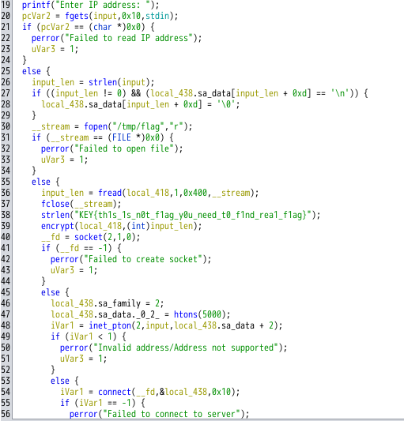
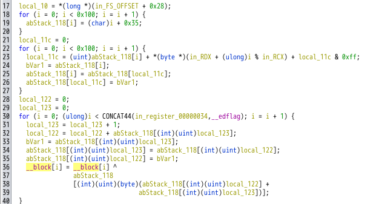
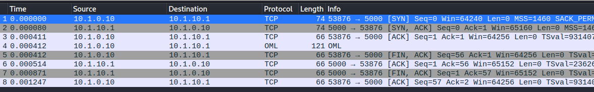
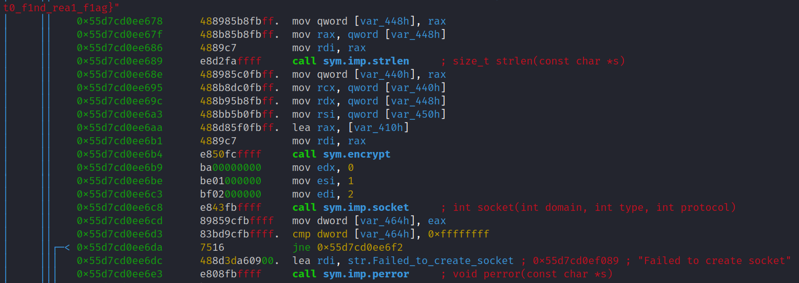

# My solution for Leak
`leak` というバイナリと，`record.pcap` というパケットキャプチャファイルが与えられる．

> サーバーから不審な通信を検出しました！
> 調査したところさらに不審なファイルを発見したので、通信記録と合わせて解析してください。
>機密情報が流出してしまったかも...？

問題文から，不審なファイルが `leak`，不審な通信記録が `record.pcap` だと推測できる．


`leak` を実行すると IPアドレスを入力するよう促されるので，`172.0.0.1` を入力するとファイルが無いというエラーで実行が終了する．

```
$ ./leak                                                                                                                                                                               
Enter IP address: 172.0.0.1
Failed to open file: No such file or directory
```

## Ghidra
### main の解析
`leak` をGhidra で解析する．`Stripped` ではないので，`main関数` はすぐに見つかる．

<figure></figure>

これは `main関数` を抜粋したものであるが，先ほどのエラーは`/tmp/flag` に`flag` が存在しないからであったことがわかる．

`main関数` の処理を追うと，以下のことが推測できる．
- `/tmp/flag` ファイルからデータを`local_418` に読み込む．
- `encrypt関数` で`local_418` を暗号化(?) 
- `socket(2,1,0)` でソケットを作成する．
- 暗号化したデータを送信

よって，パケットから暗号化したデータを取り出し，復号すればフラグが求まるかもしれない．

### encrypt の解析
暗号化関数の処理によっては，復号が容易かもしれない．
<figure></figure>

`encrypt関数` は，36行目の `__block[i] = __block[i] ^ ` まで，引数に対する処理はない．

36行目で初めて，それまでで演算していた`abStack_118` と **第一引数**  `__block[i]` を `XOR` する．

そして，`encrypt関数` の第一引数として与えられていたのは，`/tmp/flag` のデータである．

つまり，暗号化処理の肝は `XOR` なので，暗号化して送られたデータをもう一度 `encrypt` すれば，`/tmp/flag` のデータに戻ると推測できる．

## Wireshark 
パケットキャプチャファイルを解析する．
<figure></figure>

パケットはたったの8個であり，1 ~ 3個目がTCPのハンドシェイク，5 ~ 8個目がTCPコネクションの終了の際の `FIN` と `ACK` である．4個目のパケットでデータが送信されていると推測できる． 

Wireshark の `[Follow] -> [TCP Stream]` にて `Raw形式` でデータを`/tmp/flag` パスに保存する．

## radare2 で動的解析
`/tmp/flag` パスに暗号化データがあるので，後はそれを`encrypt` した直後にブレイクポイントを張り，暗号化（復号）されたものを覗けばよい．

```
$ r2 -d leak
[0x7f823bd469c0]> aaa
[0x7f823bd469c0]> pdf @main
```
<figure></figure>

`encrypt`直後にブレイクポイントを張る．

今回は，`0x55d7cd0ee6b9` である．（アドレスは実行ごとに変わることに注意）

ブレイクポイントを張り，処理を続けるとIPアドレスを尋ねられるが，適当な13文字を入力すればよい．

すると，ブレイクポイントで処理が止まる．
```
[0x7f823bd469c0]> db 0x55d7cd0ee6b9
[0x7f823bd469c0]> dc
Enter IP address: 1111111111111
INFO: hit breakpoint at: 0x55d7cd0ee6b9
[0x55d7cd0ee6b9]> pd 1
│           ;-- rip:
│           0x55d7cd0ee6b9 b    ba00000000     mov edx, 0
```

後は，`encrypt` の第一引数を覗けばよい．`var_410h (rbp-0x410)`がそれに該当する．
すると，上手くフラグが復号（暗号化）できていることがわかる．

```
[0x55d7cd0ee6b9]> px @ rbp-0x410
- offset -      2021 2223 2425 2627 2829 2A2B 2C2D 2E2F  0123456789ABCDEF
0x7ffc44d26f20  6374 6634 627b 7034 795f 6e30 5f34 7474  ctf4b{p4y_n0_4tt                                                                                    
0x7ffc44d26f30  656e 7431 306e 5f74 305f 7434 6174 5f6d  ent10n_t0_t4at_m
0x7ffc44d26f40  346e 5f62 6568 316e 645f 7434 655f 6375  4n_beh1nd_t4e_cu
0x7ffc44d26f50  7234 6131 6e7d 0a00 0700 0000 2300 0000  r4a1n}......#...
0x7ffc44d26f60  d0ea d53b 827f 0000 cd9b d33b 827f 0000  ...;.......;....
0x7ffc44d26f70  0000 0000 0000 0000 60a1 d23b 827f 0000  ........`..;....
0x7ffc44d26f80  0d00 0000 0000 0000 9861 cf3b 827f 0000  .........a.;....
0x7ffc44d26f90  5874 d244 fc7f 0000 0000 0000 0000 0000  Xt.D............
0x7ffc44d26fa0  20e0 d53b 827f 0000 aebf d33b 827f 0000   ..;.......;....
0x7ffc44d26fb0  0100 0000 0000 0000 0000 0000 0000 0000  ................
0x7ffc44d26fc0  78c8 d23b 827f 0000 c028 d43b 827f 0000  x..;.....(.;....
0x7ffc44d26fd0  68f6 d53b 827f 0000 c073 d244 fc7f 0000  h..;.....s.D....
0x7ffc44d26fe0  0100 0000 0000 0000 0000 0000 0000 0000  ................
0x7ffc44d26ff0  5874 d244 fc7f 0000 9ae2 d33b 827f 0000  Xt.D.......;....
0x7ffc44d27000  0000 0000 0000 0000 2068 cf3b 827f 0000  ........ h.;....
0x7ffc44d27010  5874 d244 fc7f 0000 0000 0000 0000 0000  Xt.D............
```

`px` ではなく，`ps` を用いるとAscii文字列のみを表示してくれる．

```
[0x55d7cd0ee6b9]> ps/64x @ rbp-0x410
ctf4b{p4y_n0_4ttent10n_t0_t4at_m4n_beh1nd_t4e_cur4a1n}
```

# Further study
ちなみに，`encrypt関数` は，カスタムされた`RC4` であった．
カスタムRC4 を実装すれば，バイナリを実行しなくてもフラグを得ることができる．
実装に関しては，[他の人のWriteup](https://tan.hatenadiary.jp/entry/2023/06/05/001017) を参照されたい．

# Further study 2
先ほどの解析した `record.pcap` から，サーバ側のポート番号 `5000` に対してデータが送られていることがわかっている．

`Ghidra` の解析結果からも `hton(5000)` が使われており，ポート番号が `5000` だと分かる．

であれば，`netcat` コマンドで `Listen`すればよいのではと思いやってみた．

まず，`/tmp/flag` に `Wireshark` から取得した `flag` ファイルを置いておく．

そして，二つのターミナル(クライアント・サーバ) を立ち上げる．

サーバ側では `netcat` で接続待ちを行う．
```
$ nc -l -p 5000
```
クライアント側で，`leak` を実行し，`127.0.0.1` を入力する．
```
$ ./leak                                         
Enter IP address: 127.0.0.1
Data sent successfully
```
サーバ側にフラグが送られてきていることが確認できる．
```
$ nc -l -p 5000                                         
ctf4b{p4y_n0_4ttent10n_t0_t4at_m4n_beh1nd_t4e_cur4a1n}
```