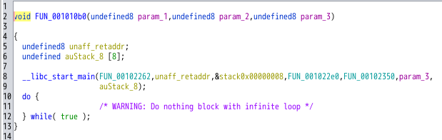
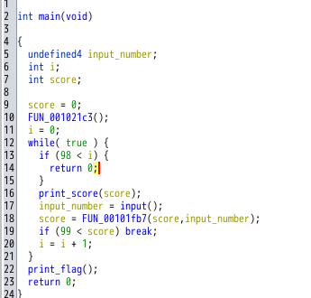
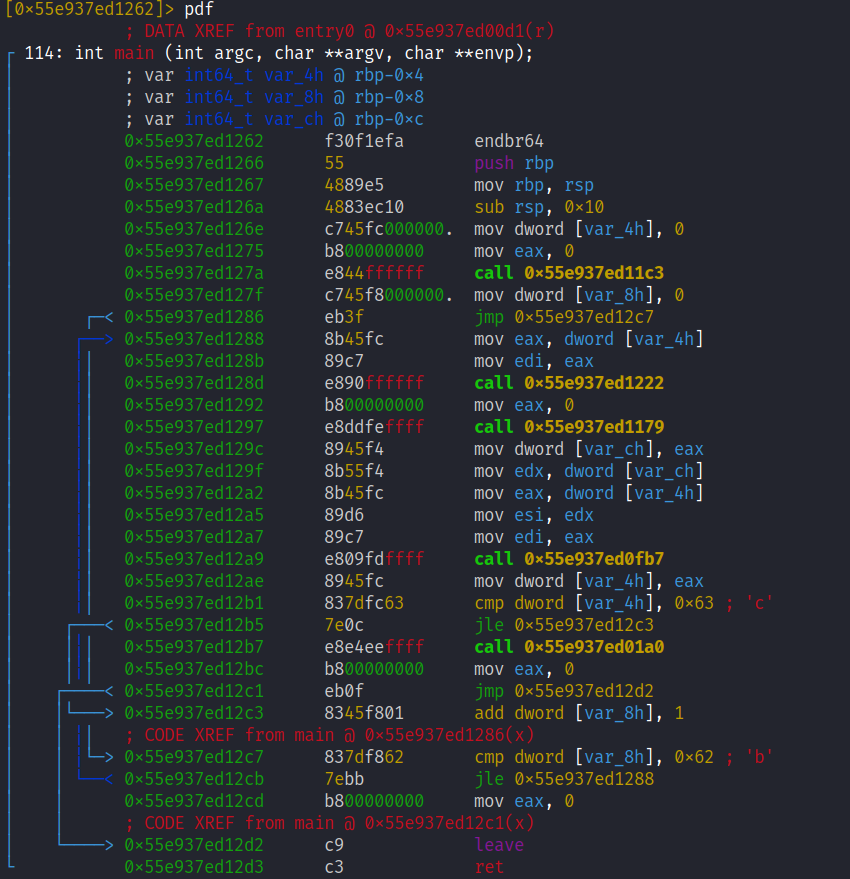

# My solution for Poker
## ざっくりとしたバイナリの把握
`Poker` というバイナリが与えられる．

実行すると，1か2の入力を求められる．
```
╰─>$ ./poker                                                                                                                            

██╗███╗   ██╗██████╗ ██╗ █████╗ ███╗   ██╗    ██████╗  ██████╗ ██╗  ██╗███████╗██████╗
██║████╗  ██║██╔══██╗██║██╔══██╗████╗  ██║    ██╔══██╗██╔═══██╗██║ ██╔╝██╔════╝██╔══██╗
██║██╔██╗ ██║██║  ██║██║███████║██╔██╗ ██║    ██████╔╝██║   ██║█████╔╝ █████╗  ██████╔╝
██║██║╚██╗██║██║  ██║██║██╔══██║██║╚██╗██║    ██╔═══╝ ██║   ██║██╔═██╗ ██╔══╝  ██╔══██╗
██║██║ ╚████║██████╔╝██║██║  ██║██║ ╚████║    ██║     ╚██████╔╝██║  ██╗███████╗██║  ██║
╚═╝╚═╝  ╚═══╝╚═════╝ ╚═╝╚═╝  ╚═╝╚═╝  ╚═══╝    ╚═╝      ╚═════╝ ╚═╝  ╚═╝╚══════╝╚═╝  ╚═

================
| Score :   0  |
================

[?] Enter 1 or 2: 
```

数回入力してみると，適切な入力でなければスコアが0に戻ってしまうことが分かる．

```
╰─>$ ./poker                                                                                                                                                           

██╗███╗   ██╗██████╗ ██╗ █████╗ ███╗   ██╗    ██████╗  ██████╗ ██╗  ██╗███████╗██████╗
██║████╗  ██║██╔══██╗██║██╔══██╗████╗  ██║    ██╔══██╗██╔═══██╗██║ ██╔╝██╔════╝██╔══██╗
██║██╔██╗ ██║██║  ██║██║███████║██╔██╗ ██║    ██████╔╝██║   ██║█████╔╝ █████╗  ██████╔╝
██║██║╚██╗██║██║  ██║██║██╔══██║██║╚██╗██║    ██╔═══╝ ██║   ██║██╔═██╗ ██╔══╝  ██╔══██╗
██║██║ ╚████║██████╔╝██║██║  ██║██║ ╚████║    ██║     ╚██████╔╝██║  ██╗███████╗██║  ██║
╚═╝╚═╝  ╚═══╝╚═════╝ ╚═╝╚═╝  ╚═╝╚═╝  ╚═══╝    ╚═╝      ╚═════╝ ╚═╝  ╚═╝╚══════╝╚═╝  ╚═

================
| Score :   0  |
================

[?] Enter 1 or 2: 1
[-] Player 2 wins! Your score is reseted...

================
| Score :   0  |
================

[?] Enter 1 or 2: 2
[+] Player 2 wins! You got score!

================
| Score :   1  |
================

[?] Enter 1 or 2: 2
[+] Player 2 wins! You got score!

================
| Score :   2  |
================

[?] Enter 1 or 2: 2
[-] Player 1 wins! Your score is reseted...

================
| Score :   0  |
================

[?] Enter 1 or 2: 
```

勝ち続ければフラグは得られそうだが，それが困難なことは明らかなので， `Ghidra` で解析することにする．

## Ghidra
このバイナリは `stripped` でシンボル情報が消されているため，Ghidra で解析しても `main関数` はすぐに見つからない．

まず，エントリポイントのアドレスを調べる．
```
$ readelf -h poker | grep エントリ                                                                                    
  エントリポイントアドレス:          0x10b0
```
Ghidra にて `0x10b0` アドレスの場所をみる．`FUN_001010b0` という関数が該当箇所である．

`001010b0` であって`000010b0` でないのは，Ghidra のイメージアドレスの影響である([参考](../../../WaniCTF2023/theseus/solve/writeup.md))．
<figure></figure>

`libc_start_main` の第一引数は `main関数` であるので([参考](https://kashiwaba-yuki.com/ctf-elf-training#%E3%82%A8%E3%83%B3%E3%83%88%E3%83%AA%E3%83%9D%E3%82%A4%E3%83%B3%E3%83%88%E3%81%8B%E3%82%89main%E9%96%A2%E6%95%B0%E3%82%92%E7%89%B9%E5%AE%9A%E3%81%99%E3%82%8B))，`FUN_00102262` が `main関数` であると特定できる．

そして，`FUN_00102262` を `main` に名前を変え，main関数で呼び出されている `関数` や `変数` も目的に応じた名前に変更すると，以下のようになる．
<figure></figure>

main関数の処理から分かることは，`score` が `100` になれば `print_flag` に到達しフラグが出力されることである．

そこで，`if (99 < score)` を `if (99 > score)` に書き換えるパッチをあてる．
具体的には，`JLE` を `JGE` に書き換えればよい．
(やり方は，[過去のWriteup](../../../WaniCTF2023/fermat/solve/writeup.md) を参考．)

パッチを当てたバイナリを実行し，適当に数字を入力するとフラグが得られる．

```
╰─>$ ./patch                                                                                                                                                           

██╗███╗   ██╗██████╗ ██╗ █████╗ ███╗   ██╗    ██████╗  ██████╗ ██╗  ██╗███████╗██████╗
██║████╗  ██║██╔══██╗██║██╔══██╗████╗  ██║    ██╔══██╗██╔═══██╗██║ ██╔╝██╔════╝██╔══██╗
██║██╔██╗ ██║██║  ██║██║███████║██╔██╗ ██║    ██████╔╝██║   ██║█████╔╝ █████╗  ██████╔╝
██║██║╚██╗██║██║  ██║██║██╔══██║██║╚██╗██║    ██╔═══╝ ██║   ██║██╔═██╗ ██╔══╝  ██╔══██╗
██║██║ ╚████║██████╔╝██║██║  ██║██║ ╚████║    ██║     ╚██████╔╝██║  ██╗███████╗██║  ██║
╚═╝╚═╝  ╚═══╝╚═════╝ ╚═╝╚═╝  ╚═╝╚═╝  ╚═══╝    ╚═╝      ╚═════╝ ╚═╝  ╚═╝╚══════╝╚═╝  ╚═

================
| Score :   0  |
================

[?] Enter 1 or 2: 1
[-] Player 2 wins! Your score is reseted...
[!] You got a FLAG! ctf4b{4ll_w3_h4v3_70_d3cide_1s_wh4t_t0_d0_w1th_7he_71m3_7h47_i5_g1v3n_u5}
```

# Further study
## radare2 を使った動的解析
`radare2` を使い，無理やり `print_flag` に処理を移す方法を試してみる．

まずは，`main関数` のアセンブリを表示する．
```
$ r2 -d poker
[0x7f59694ab9c0]> aaa
[0x7f59694ab9c0]> s main
[0x55e937ed1262]> pdf
```

<figure></figure>

やりたいことは，無理やり `call 0x55e937ed01a0` に処理を移すことである．

つまり，`cmp dword [var_4h], 0x63` が実行されるとき，`dword [var_4h]` が `0x63` よりも大きい値であればよい．

`cmp dword [var4h], 0x63` にブレイクポイントを張り，`dc` で処理を続ける．すると，ブレイクポイントで処理が止まる．

```
[0x55e937ed1262]> db 0x55e937ed12b1
[0x55e937ed1262]> dc

██╗███╗   ██╗██████╗ ██╗ █████╗ ███╗   ██╗    ██████╗  ██████╗ ██╗  ██╗███████╗██████╗
██║████╗  ██║██╔══██╗██║██╔══██╗████╗  ██║    ██╔══██╗██╔═══██╗██║ ██╔╝██╔════╝██╔══██╗
██║██╔██╗ ██║██║  ██║██║███████║██╔██╗ ██║    ██████╔╝██║   ██║█████╔╝ █████╗  ██████╔╝
██║██║╚██╗██║██║  ██║██║██╔══██║██║╚██╗██║    ██╔═══╝ ██║   ██║██╔═██╗ ██╔══╝  ██╔══██╗
██║██║ ╚████║██████╔╝██║██║  ██║██║ ╚████║    ██║     ╚██████╔╝██║  ██╗███████╗██║  ██║
╚═╝╚═╝  ╚═══╝╚═════╝ ╚═╝╚═╝  ╚═╝╚═╝  ╚═══╝    ╚═╝      ╚═════╝ ╚═╝  ╚═╝╚══════╝╚═╝  ╚═

================
| Score :   0  |
================

[?] Enter 1 or 2: 1
[+] Player 1 wins! You got score!
INFO: hit breakpoint at: 0x55e937ed12b1
[0x55e937ed12b1]> pd 1
│           ;-- rip:
│           0x55e937ed12b1 b    837dfc63       cmp dword [var_4h], 0x63 ; 'c'
```

次に，`var4h` がさすメモリの `dword` (4bytes) 分を表示する．
ちなみに，`var4h` は `@rbp-0x4` であることが，`pdf` で表示したディスアセンブリに書かれている．

```
[0x55e937ed12b1]> px/4x @rbp-0x4
- offset -      3C3D 3E3F 4041 4243 4445 4647 4849 4A4B  CDEF0123456789AB
0x7ffdea90493c  0100 0000                                ....
```
現在は `0x01` となっているので，これを `0x63` より大きい値に書き換えればよい．

```
[0x55e937ed12b1]> wx 0x64 @rbp-0x4
[0x55e937ed12b1]> px/1x @rbp-0x4
- offset -      3C3D 3E3F 4041 4243 4445 4647 4849 4A4B  CDEF0123456789AB
0x7ffdea90493c  64  
```
上記のコマンドを入力すると，`0x64` に書き換わる．
そして，`dc` で処理を再開すればよい．

```
[0x55e937ed12b1]> dc
[!] You got a FLAG! ctf4b{4ll_w3_h4v3_70_d3cide_1s_wh4t_t0_d0_w1th_7he_71m3_7h47_i5_g1v3n_u5}
(3920981) Process exited with status=0x0
```