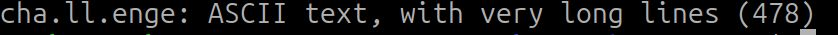
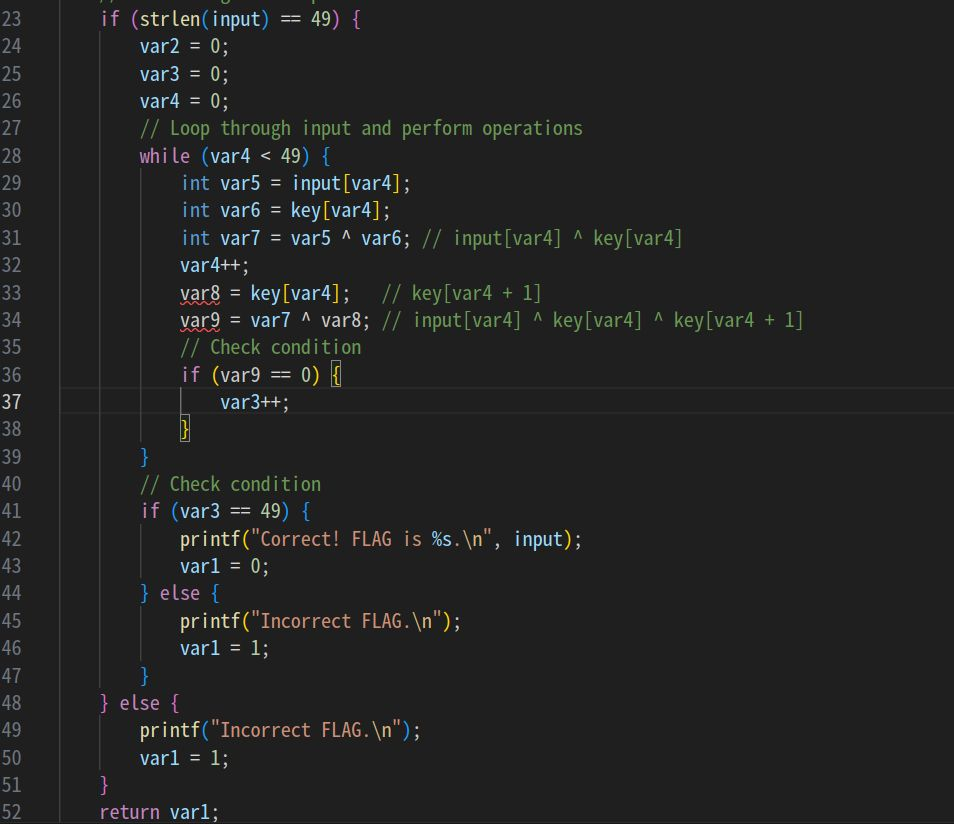

# My solution for cha-ll-enge
与えられたファイルは`cha.ll.enge`で、ファイル名だけ確認してもわからないため、とりま、`file cha.ll.enge`で何をファイル化を確認する。



この結果から実行ファイルでは無いことが考えられるため、ファイルの中身を覗いてみることにする。

<details>
    <summary>cha.ll.engeのファイルの中身</summary>

@__const.main.key = private unnamed_addr constant [50 x i32] [i32 119, i32 20, i32 96, i32 6, i32 50, i32 80, i32 43, i32 28, i32 117, i32 22, i32 125, i32 34, i32 21, i32 116, i32 23, i32 124, i32 35, i32 18, i32 35, i32 85, i32 56, i32 103, i32 14, i32 96, i32 20, i32 39, i32 85, i32 56, i32 93, i32 57, i32 8, i32 60, i32 72, i32 45, i32 114, i32 0, i32 101, i32 21, i32 103, i32 84, i32 39, i32 66, i32 44, i32 27, i32 122, i32 77, i32 36, i32 20, i32 122, i32 7], align 16
@.str = private unnamed_addr constant [14 x i8] c"Input FLAG : \00", align 1
@.str.1 = private unnamed_addr constant [3 x i8] c"%s\00", align 1
@.str.2 = private unnamed_addr constant [22 x i8] c"Correct! FLAG is %s.\0A\00", align 1
@.str.3 = private unnamed_addr constant [16 x i8] c"Incorrect FLAG.\00", align 1

; Function Attrs: noinline nounwind optnone uwtable
define dso_local i32 @main() #0 {
  %1 = alloca i32, align 4
  %2 = alloca [70 x i8], align 16
  %3 = alloca [50 x i32], align 16
  %4 = alloca i32, align 4
  %5 = alloca i32, align 4
  %6 = alloca i64, align 8
  store i32 0, i32* %1, align 4
  %7 = bitcast [50 x i32]* %3 to i8*
  call void @llvm.memcpy.p0i8.p0i8.i64(i8* align 16 %7, i8* align 16 bitcast ([50 x i32]* @__const.main.key to i8*), i64 200, i1 false)
  %8 = call i32 (i8*, ...) @printf(i8* noundef getelementptr inbounds ([14 x i8], [14 x i8]* @.str, i64 0, i64 0))
  %9 = getelementptr inbounds [70 x i8], [70 x i8]* %2, i64 0, i64 0
  %10 = call i32 (i8*, ...) @__isoc99_scanf(i8* noundef getelementptr inbounds ([3 x i8], [3 x i8]* @.str.1, i64 0, i64 0), i8* noundef %9)
  %11 = getelementptr inbounds [70 x i8], [70 x i8]* %2, i64 0, i64 0
  %12 = call i64 @strlen(i8* noundef %11) #4
  %13 = icmp eq i64 %12, 49
  br i1 %13, label %14, label %48

14:                                               ; preds = %0
  store i32 0, i32* %4, align 4
  store i32 0, i32* %5, align 4
  store i64 0, i64* %6, align 8
  br label %15

15:                                               ; preds = %38, %14
  %16 = load i64, i64* %6, align 8
  %17 = icmp ult i64 %16, 49
  br i1 %17, label %18, label %41

18:                                               ; preds = %15
  %19 = load i64, i64* %6, align 8
  %20 = getelementptr inbounds [70 x i8], [70 x i8]* %2, i64 0, i64 %19
  %21 = load i8, i8* %20, align 1
  %22 = sext i8 %21 to i32
  %23 = load i64, i64* %6, align 8
  %24 = getelementptr inbounds [50 x i32], [50 x i32]* %3, i64 0, i64 %23
  %25 = load i32, i32* %24, align 4
  %26 = xor i32 %22, %25
  %27 = load i64, i64* %6, align 8
  %28 = add i64 %27, 1
  %29 = getelementptr inbounds [50 x i32], [50 x i32]* %3, i64 0, i64 %28
  %30 = load i32, i32* %29, align 4
  %31 = xor i32 %26, %30
  store i32 %31, i32* %5, align 4
  %32 = load i32, i32* %5, align 4
  %33 = icmp eq i32 %32, 0
  br i1 %33, label %34, label %37

34:                                               ; preds = %18
  %35 = load i32, i32* %4, align 4
  %36 = add nsw i32 %35, 1
  store i32 %36, i32* %4, align 4
  br label %37

37:                                               ; preds = %34, %18
  br label %38

38:                                               ; preds = %37
  %39 = load i64, i64* %6, align 8
  %40 = add i64 %39, 1
  store i64 %40, i64* %6, align 8
  br label %15, !llvm.loop !6

41:                                               ; preds = %15
  %42 = load i32, i32* %4, align 4
  %43 = icmp eq i32 %42, 49
  br i1 %43, label %44, label %47

44:                                               ; preds = %41
  %45 = getelementptr inbounds [70 x i8], [70 x i8]* %2, i64 0, i64 0
  %46 = call i32 (i8*, ...) @printf(i8* noundef getelementptr inbounds ([22 x i8], [22 x i8]* @.str.2, i64 0, i64 0), i8* noundef %45)
  store i32 0, i32* %1, align 4
  br label %50

47:                                               ; preds = %41
  br label %48

48:                                               ; preds = %47, %0
  %49 = call i32 @puts(i8* noundef getelementptr inbounds ([16 x i8], [16 x i8]* @.str.3, i64 0, i64 0))
  store i32 1, i32* %1, align 4
  br label %50

50:                                               ; preds = %48, %44
  %51 = load i32, i32* %1, align 4
  ret i32 %51
}


</details>


これは一体何をしているのかchatGPTにとりあえず投げてみた。すると、これは中間表現と呼ばれるものであり、高級言語から機械語に変換されるときになる形らしい。（認識が間違っていたら指摘してください）

                    高級言語→中間言語→機械語

途中読める箇所がいくつか確認できるが、普段から中間言語を見ている人でないと読み解くことが難しそうなため、もう一度chatGPTに`C言語に直してください`とお願いしてみることにした。すると、次の結果が返ってきたきた。

<details>
    <summary>返ってきたC言語</summary>

#include <stdio.h>
#include <string.h>
// Constant array representing the key
const int __const_main_key[50] = {119, 20, 96, 6, 50, 80, 43, 28, 117, 22, 125, 34, 21, 116, 23, 124, 35, 18, 35, 85, 56, 103, 14, 96, 20, 39, 85, 56, 93, 57, 8, 60, 72, 45, 114, 0, 101, 21, 103, 84, 39, 66, 44, 27, 122, 77, 36, 20, 122, 7};
// Strings for output messages
const char __str[] = "Input FLAG : ";
const char __str1[] = "%s";
const char __str2[] = "Correct! FLAG is %s.\n";
const char __str3[] = "Incorrect FLAG.\n";
int main() {
    int var1;
    char input[70];
    int key[50];
    int var2;
    int var3;
    long long var4;
    // Initialize key array with constant values
    memcpy(key, __const_main_key, sizeof(__const_main_key));
    printf("%s", __str);
    scanf("%s", input);
    // Check length of input
    if (strlen(input) == 49) {
        var2 = 0;
        var3 = 0;
        var4 = 0;
        // Loop through input and perform operations
        while (var4 < 49) {
            int var5 = input[var4];
            int var6 = key[var4];
            int var7 = var5 ^ var6;
            var4++;
            var8 = key[var4];
            var9 = var7 ^ var8;
            // Check condition
            if (var9 == 0) {
                var3++;
            }
        }
        // Check condition
        if (var3 == 49) {
            printf("Correct! FLAG is %s.\n", input);
            var1 = 0;
        } else {
            printf("Incorrect FLAG.\n");
            var1 = 1;
        }
    } else {
        printf("Incorrect FLAG.\n");
        var1 = 1;
    }
    return var1;
}

</details>

これから予測できることは、
- 入力が`49文字`であること
- `__const_main_key`がFlagが関係ありそう

詳しく、プログラムを見てみるとFlagの取得に必要そうなループがあることが確認できる。



42行目から、`input`がFlagとして出力されることが分かる。また、36行目から`var9 == 0`となることでinputに入力された文字列とFlagが同じであることを確認していることが分かる。  
34行目を確認するとXORでその確認をしている。（分かりやすくするためにコメントアウトに記述）  
XORの特徴として、同じ値でXORを取ると0になることから、`input[var4]とkey[var4]^key[var4+1]`は等しい。また、inputがFlagになることから、`key[var4]^key[var4+1]`がFlagになることが分かる。

次のようなsolve.pyを動かすことで回答を得ることができた。

```python
key = [119, 20, 96, 6, 50, 80, 43, 28, 117, 22, 125, 34, 21, 116, 23, 124, 35, 18, 35, 85, 56, 103, 14, 96, 20, 39, 85, 56, 93, 57, 8, 60, 72, 45, 114, 0, 101, 21, 103, 84, 39, 66, 44, 27, 122, 77, 36, 20, 122, 7]

flag = [key[i] ^ key[i+1] for i in range(49)]

print(''.join([chr(i) for i in flag]))
```

実行するとFlagが求まる。

`ctf4b{7ick_7ack_11vm_int3rmed14te_repr3sen7a7i0n}`