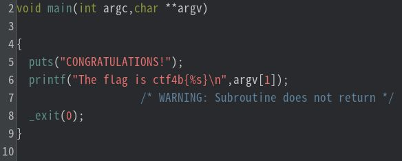
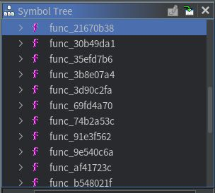
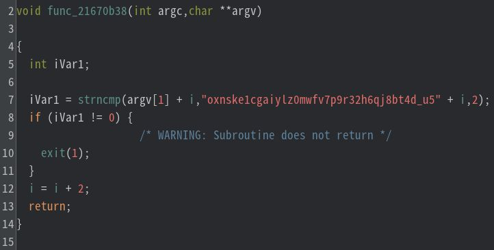
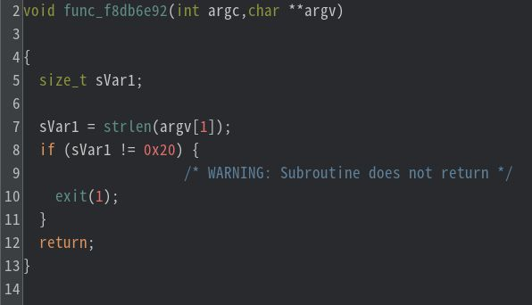
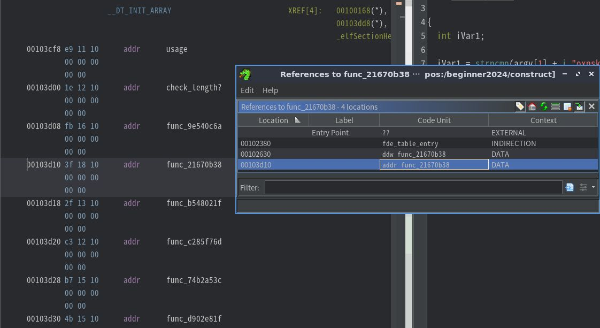

# My solution for construct
`construct` というELFファイルが配布される。`strings` により可読文字列を表示してみると、怪しい文字列`c7l9532k0avfxso4uzipd18egbnyw6rm_tqjh` や `CONGRATULATIONS!`、`WRONG`などがみえることから、この問題はフラグチェッカーだと推測できる。また、`usage: construct <password>` よりコマンドライン引数にフラグを入力するタイプのフラグチェッカーである。

```
$ strings -d construct
/lib64/ld-linux-x86-64.so.2
puts
strlen
_exit
__libc_start_main
__cxa_finalize
printf
strncmp
libc.so.6
GLIBC_2.2.5
GLIBC_2.34
_ITM_deregisterTMCloneTable
__gmon_start__
_ITM_registerTMCloneTable
PTE1
u+UH
usage: construct <password>
c7l9532k0avfxso4uzipd18egbnyw6rm_tqjh
9_xva4uchnkyi6wb2ld507p8g3stfej1rzqmo
lzau7rvb9qh5_1ops6jg3ykf8x0emtcind24w
l8s0xb4i1frkv6a92j5eycng3mwpzduqth_7o
17zv5h6wjgbqerastioc294n0lxu38fdk_ypm
_k6nj8hyxvzcgr1bu2petf5qwl09ids!om347a
1cgovr4tzpnj29ay3_8wk7li6uqfmhe50bdsx
tufij3cykhrsl841qo6_0dwg529zanmbpvxe7
r8x9wn65701zvbdfp4ioqc2hy_juegkmatls3
aj_d29wcrqiok53b7tyn0p6zvfh1lxgum48es
l539rbmoifye0u6dj1pw8nqt_74sz2gkvaxch
c0_d4yk261hbosje893w5igzfrvaumqlptx7n
b0i21csjhqug_3erat9f6mx854pyol7zkvdwn
3mq16t9yfs842cbvlw5j7k0prohengduzx_ai
oxnske1cgaiylz0mwfv7p9r32h6qj8bt4d_u5
3icj_go9qd0svxubefh14ktywpzma2l7nr685
CONGRATULATIONS!
The flag is ctf4b{%s}
WRONG
9*3$"
```

Ghidra で静的解析を行う。main関数をみてみると、いきなり`CONGRATULATIONS!` が出力される処理から始まる。どういう原理かわからないが、フラグチェック部分はmain関数よりも前にありそうである。



ここで問題文にもあるように、使われていないように見える関数たちに注目してみる。以下の画像のように、Ghidra上ではどこからも呼ばれていなさそうな関数がたくさんあることがわかる。



それらの関数はほとんど同じ処理をしている。例えば`func_21670b38` を見てみる（関数の引数の型に変更を加えている）と、フラグの判定の一部であると推測できる。なぜなら、変更を加えた関数の第２引数(`argv`) がコマンドライン引数だと仮定すると、**コマンドライン引数のi番目とi+1番目の文字** と **oxnske1cgaiylz0mwfv7p9r32h6qj8bt4d_u5のi番目とi+1番目の文字** がを比較していると考えられるからである。



また、入力文字列の長さを判定していそうな関数(`func_f8db6e92`)が見つかった。これが長さの判定をしているとすれば、フラグの長さは32文字である。先程の`func_21670b38` のような**入力文字列の2文字をチェックしている関数**は16個あったことから、おおむねこの推測はあってそうである。



あとは`strings`の結果にも含まれていた`oxnske1cgaiylz0mwfv7p9r32h6qj8bt4d_u5` のような文字列16個からFLAGを構成すればよい。しかし、`oxnske1cgaiylz0mwfv7p9r32h6qj8bt4d_u5` のような文字列の何番目(i, i+1番目)が比較されているのか、つまり`func_21670b38` のような16個の関数の呼び出されている順番が分からない。

そこでGhidraの`Find Rerences to func_21670b38` により、`func_21670b38` を参照するアドレスを確認してみる。すると、``__DT_INIT_ARRAY`` で関数のアドレスがリストされていることが分かる。この`__DT_INIT_ARRAY`について調べてみると、これらの初期化関数はmain関数よりも前に実行されるようであり、main関数がいきなり`Congraturations!`から始まっていたことにも納得である（main関数にまで辿り着くような入力文字列がFLAG）。



`__DT_INIT_ARRAY` にリストされている関数が順に実行されることが分かったので、関数内で比較されている文字列のi番目とi+1番目を取り出すような[スクリプト](./solve.py)を書けばFLAGが求まる。

`ctf4b{c0ns7ruc70rs_3as3_h1d1ng_7h1ngs!}`