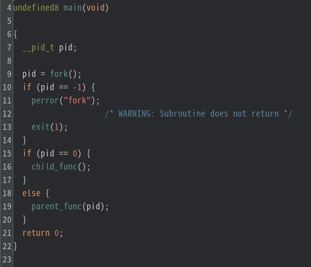
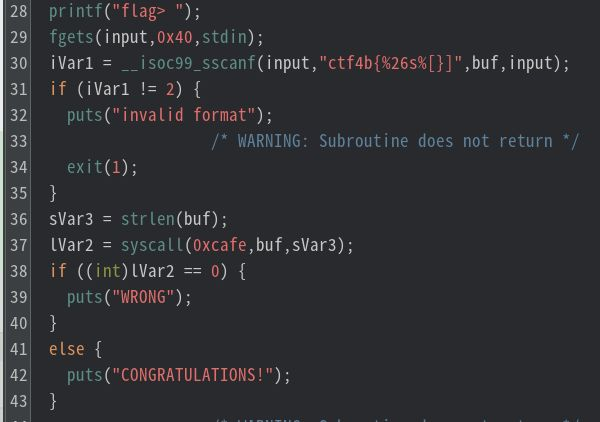
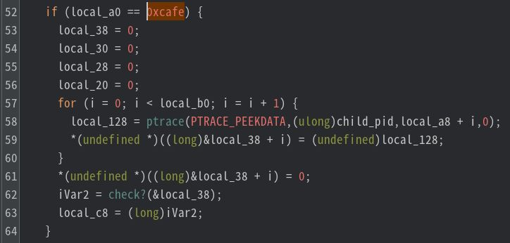
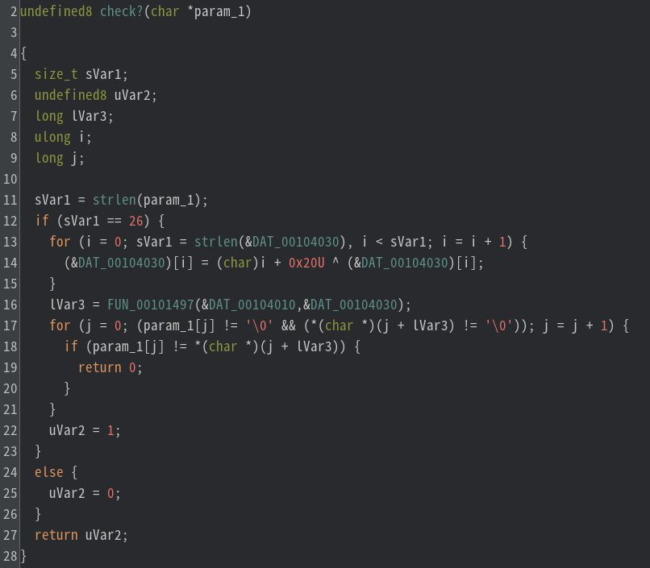
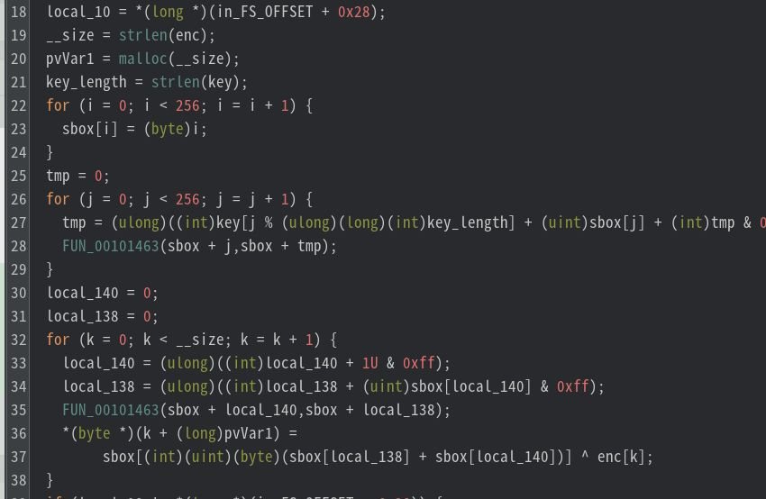

# My solution for former-seccomp

`former-seccomp`というELFファイルが配布される。実行してみると、この問題もフラグチェッカーのようである。

Ghidraでmain関数をみてみる。適宜、変数名を変更しながら解析すると、このプログラムは子プロセスを生成し親プロセスと子プロセスで異なる処理を行うことがわかる。

まずは、`child_func` を見てみる。特に重要なのは以下の部分で、入力文字列を受取りカスタムシステムコール(`sycall(0xcafe, buf, sVar3)`)でフラグのチェックを行っていると推測できる。

つぎに、`parent_func` を見てみる。特に重要そうなのは以下の部分である。なぜなら、子プロセスの関数で呼び出していたシステムコールの番号が確認できる（52行目）ことと、`parent_func`内で唯一ユーザ定義の関数（62行目）が呼び出されているからである。

`check?`関数を見てみると、次のことがわかる。
- 文字列の長さが26文字か判定
- `DAT_00104030` にあるデータを書き換え
  - 加算とXORの単純な演算
- `FUN_00101497` を呼び出す
  - 先程書き換えた`DAT_00104030` が引数として渡されている
  - `DAT_00104010` はなにかしらのデータ
- **`FUN_00101497` によって返された`lvar3` が指すデータ**と**check関数に渡された第一引数(param_1)が指すデータ** を比較
  - `FUN_00101497` 実行直後、`lvar3` がさすアドレスにFLAGがありそう

とりあえず、`DAT_00104030` の演算処理を[pythonで模倣](./dat.py)してみると、`ctf4b:2024`という文字列が`DAT_00104030` に書き込まれることがわかった。これは暗号処理の鍵っぽい。

つぎに、`FUN_00101497` を見てみると（すでにGhidraの変数名に変更を加えている）、明らかにRC4っぽい処理が見える。例えば、長さ256の配列を初期化していることなどがRC4の特徴である。（[参考](https://yasulib.hatenablog.jp/entry/20180127/1517041821)）

ということは、`FUN_00101497` の第一引数である`DAT_00104010` はRC4により暗号化されたデータであるので、先程の鍵を利用して復号すればFLAGは求まりそうである。ただし、これはRC4になんの手も加えられていない場合のみではあるが、とりあえず[Cyberchefを用いて復号化](https://gchq.github.io/CyberChef/#recipe=RC4(%7B'option':'UTF8','string':'ctf4b:2024'%7D,'Hex','Latin1')&input=YTVkMmJjMDJiMjdjODYzODE3YjEzOGM2ZTQ1YzFmYTA5ZDk2ZDFmMDRiYTZhNjVjNjRiNw&oeol=FF)してみた。すると、デフォルトのRC4だったようで、簡単にFLAGを求めることができた。

`ctf4b{p7r4c3_c4n_3mul4t3_sysc4ll}`