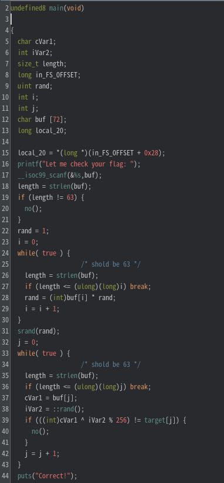

# My solution for Flagcheck
ELFファイルが与えられる。
```
file chall
chall: ELF 64-bit LSB pie executable, x86-64, version 1 (SYSV), dynamically linked, interpreter /lib64/ld-linux-x86-64.so.2, BuildID[sha1]=68da80acf7353d56f047fa725e2506428b7c6864, for GNU/Linux 3.2.0, not stripped
```

問題文の通り、入力文字列が正しいFLAGかどうかを教えてくれるフラグチェッカーである。

Ghidraでmain関数を解析すると、フラグチェックは主に以下の手順で行われることがわかる。
- 入力文字列が63文字かどうかを判定（18~21行）
  - 63文字でなければ`Nope...` を出力し、プログラム終了
- 入力文字列の各文字のASCIIコードを掛け合わせ、その値をシード値に設定（24~31行）
- 63回ループを繰り返し、フラグを一文字ずつチェック
  - 乱数とフラグ文字をXORし、メモリ上（`target`配列）の値と一致しているかを比較



よって、`target` 配列の要素と乱数をXORすればフラグが求まるが、乱数のシード値はフラグが分からないと求めることができない。

しかし、フラグの先頭の5文字（`TBTL{`）は既知であるので、5つの乱数列は求めることができる。[pythonで5文字分XORをとる](rand_sequence.py)と、乱数列は `103, 198, 105, 115, 81` と求まる。後は、この乱数を生成するシード値をブルートフォースで求めることができれば、フラグを求めることができる。[ソルバー](./solve.c)を実行すると、フラグが求まる。
```
Found a matching seed: 0
Flag: TBTL{l1n3a4_C0ngru3n7i41_6en3r4t0r_b453d_Fl4G_Ch3ckEr_G03z_8rr}
```

実はこの問題のシード値は、整数オーバーフローにより0になっていた。