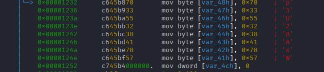

# My solution of Just_passw0rd
`just_password` というバイナリが与えれている．

`strings` コマンドで`just_password` 内の印字可能な文字列 (ASCII文字列) を表示してみる．`-d` オプションをつけることで，データセクション内の文字列だけを表示できる．
```
strings -d just_password
```
`strings` するとFLAGが見つかる．
```
/lib64/ld-linux-x86-64.so.2
nNyT&
libc.so.6
__isoc99_scanf
puts
__stack_chk_fail
printf
strlen
__cxa_finalize
__libc_start_main
GLIBC_2.7
GLIBC_2.4
GLIBC_2.2.5
_ITM_deregisterTMCloneTable
__gmon_start__
_ITM_registerTMCloneTable
u+UH
[]A\A]A^A_
Input password > 
Incorrect
Correct!
FLAG is FLAG{1234_P@ssw0rd_admin_toor_qwerty}
:*3$"
```

# Further study
この問題では，FLAGが見えてしまったが，パスワードは見えなかった．
`strings` でパスワードが表示されなかった理由を調べてみよう．

`radare2` で逆アセンブルし，main関数を覗いてみる．
```
r2 just_password
aaa
pdf @main
```
逆アセンブルしたmain関数の処理を追うと，入力文字列と比較しているpasswordを特定することができる．

<figure></figure>

アセンブリを読むと，パスワードは `mov命令` によって１バイトずつあるアドレスに動的に格納されていることが分かる．`strings` で表示されるのは静的に定義された文字列だけであるため，パスワードを`strings` で特定することができなかったのである．

