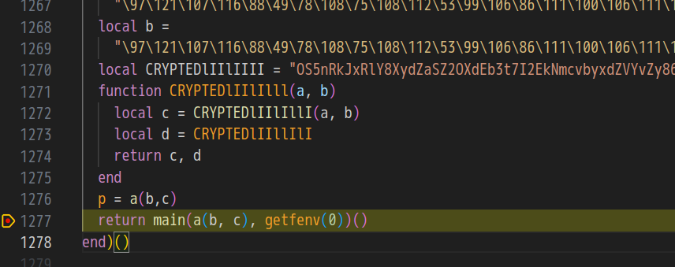

# My solution for Lua

この問題は，Luaスクリプト `main.lua` が与えられる．スクリプトは膨大な量かつ読みにくいことから，難読化が施されていることが推測できる．ちなみに，[過去のWaniCTF](https://github.com/wani-hackase/wanictf2021-writeup/tree/main/rev/emoemotet)でも，PowerShellの難読化が出題されている．

lua の難読化解除方法を調べても，あまり手がかりがつかめない．
簡単な難読化 javascript では，難読化コードを`eval` に渡している部分を探し，`console.log` すればよいので（[参考](https://www.iwsec.org/mws/2017/20171201/20171201_MWSCup2017_c1.pdf)），`eval` に相当する`laod` や`loadstring` を探していたが分からなかった．

結局難読化解除はできなさそうなので，デバッガを使って解くことにした．VSCodeの拡張機能である [LuaHelper](https://github.com/Tencent/LuaHelper) をインストールした．

このソースコードは即時関数を使っており，本質的には1276行目の`return` で渡される関数を実行しているとわかる．

```lua
return CRYPTEDlIIlIlII(CRYPTEDlIIlIIlI(CRYPTEDlIIllIll, CRYPTEDlIIlIIIl), getfenv(0))()
```
分かりにくいので，変数の名前を書き直す．
```lua
return main(a(b, c), getfenv(0))()
```
`main` に渡される引数は重要な情報が含まれているはずである．そこで，新たに`p = a(b,c)` を`return` 直前に追記し，`return` に breakpointを張り，`p` を直接見ることにした．

<figure></figure>

breakpoint で実行を止め，グローバル変数 `p` をみると，フラグが見つかった．

```
FLAG{1ua_0r_py4h0n_wh4t_d0_y0u_3ay_w4en_43ked_wh1ch_0ne_1s_be44er}
```
