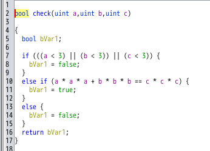
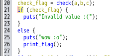

# My solution of fermat
`fermat` というバイナリが与えられる．`strings` を使っても何も得られる情報はないので，`Ghidra`で解析してみる．ストリップされていないので，main関数はすぐに見つかる．（Rename Variable や Edit Function Signature で読みやすく変更している）
<figure></figure>
<figure></figure>

入力として a, b, c を受け取り $a^3 + b^3 = c^3$ であれば，`print_flag` によりFLAGが出力されそうである．(ただし，a, b, c は3以上の整数)
しかし，フェルマーの最終定理より上式を満たすa, b, c は存在しない．

解法として以下の２つを考えた．
- `print_flag` を実装する
- `check_flag` が `False` のときに `print_flag` を実行するように，バイナリを書き換える

`print_flag` は少し面倒くさそうであったので，バイナリを書き換える方法を選んだ．`Ghidra` でパッチをあてるには，書き換えたいアセンブリ命令の上で右クリックし，さらに  `Patch Instruction` を選択する．

今回では，`JZ LAB_001014e1` を `JNZ LAB_001014e1` に書き換えればよい．該当の `JZ` の上で `Patch Instruction` を選択し `JNZ` に書き換えると，`74 18 JZ` が `75 18 JNZ` に変更される．
<figure></figure>

Decompile ウィンドウも書き換わっていることが確認できる．これで，間違った入力をしてもFLAGが出力されそうである．
<figure></figure>

しかし，このままでは `fermat` バイナリは書き換わっていないので，`Ghidra Script` で書き換えたバイナリを新たに保存する必要がある．

リポジトリ https://github.com/schlafwandler/ghidra_SavePatch の `SavePatch.py` を Ghidra Script で読み込み，実行する．
`Patch address` に `001014c7` を指定し，`Patch size` に `2 (bytes)` を指定すると，書き換えられたバイナリを保存することができる．

保存したバイナリを実行し，適当な値を入力するとFLAGが求まる．
```
$ ./patch                                                                       
Input a> 1
Input b> 1
Input c> 1
(a, b, c) = (1, 1, 1)
wow :o
FLAG{you_need_a_lot_of_time_and_effort_to_solve_reversing_208b47bd66c2cd8}
```

# Further study
`print_flag` の中身も実装してみる．GhidraでデコンパイルされたCライクなコードをコピペする．そのままではコンパイルが通らないので，型を適宜変えてやる．
``` C
# include<stdio.h>

int main(void)
{
  int i;
  unsigned int local_b8 [20];
  double local_68;
  double local_60;
  double local_58;
  double local_50;
  double local_48;
  double local_40;
  double local_38;
  double local_30;
  double local_28;
  unsigned int local_20;
  long local_10;

  local_b8[0] = 0xf781fc86;
  local_b8[1] = 0xc5afc9bb;
  local_b8[2] = 0xd5a5de9f;
  local_b8[3] = 0xefa1efa4;
  local_b8[4] = 0xefb4dfac;
  local_b8[5] = 0xc49fd6af;
  local_b8[6] = 0xefa5dda9;
  local_b8[7] = 0xefa4dea1;
  local_b8[8] = 0xdfa6d6a5;
  local_b8[9] = 0xc49fc4b2;
  local_b8[10] = 0xdfb3efaf;
  local_b8[11] = 0xefa5c6ac;
  local_b8[12] = 0xd5b6d5b2;
  local_b8[13] = 0xdea9c3b2;
  local_b8[14] = 0x80f2efa7;
  local_b8[15] = 0x87f4d2f8;
  local_b8[16] = 0x86f6d4a2;
  local_b8[17] = 0xd4a382a3;
  local_b8[18] = 0xb0c0cdf8;
  local_68 = 0;
  local_60 = 0;
  local_58 = 0;
  local_50 = 0;
  local_48 = 0;
  local_40 = 0;
  local_38 = 0;
  local_30 = 0;
  local_28 = 0;
  local_20 = 0;
  for (i = 0; i < 19; i = i + 1) {
    *(char *)((long)&local_68 + (long)(i << 2)) = (char)local_b8[i] ^ 0xc0;
    *(char *)((long)&local_68 + (long)(i * 4 + 1)) = (char)((unsigned int)local_b8[i] >> 8) ^ 0xb0;
    *(char *)((long)&local_68 + (long)(i * 4 + 2)) = (char)((unsigned int)local_b8[i] >> 16) ^ 0xc0;
    *(char *)((long)&local_68 + (long)(i * 4 + 3)) = (char)((unsigned int)local_b8[i] >> 24) ^ 0xb0;
  }
  puts((char *)&local_68);
  return 0;
}
```
コンパイルし，実行するとFLAGが出力される．
```
$ gcc solve.c -o solve
$ ./solve
FLAG{you_need_a_lot_of_time_and_effort_to_solve_reversing_208b47bd66c2cd8}
```