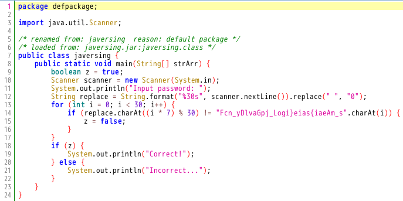

# My solution for javersing
`javersing.jar` というファイルが与えられている．
`file` コマンドを使ってファイルの種類を調べると，Java Archive (jar) であることが確認できる．
```
$ file javersing.jar 
javersing.jar: Java archive data (JAR)
```
`jadx-gui` を使うとデコンパイルした `main.java` を見ることができる．
<figure></figure>

入力文字列がFLAGである問題．
30文字の入力文字列 `replace` の `i * 7 % 30` 番目の文字を一つずつチェックし，`Fcn_yDlvaGpj_Logi}eias{iaeAm_s` の順番になっているかを判定している．

よって，`Fcn_yDlvaGpj_Logi}eias{iaeAm_s` の `i` 番目の文字を `i * 7 % 30` 番目に移動すれば，FLAGが求まる． ([solve.py](./solve.py))
``` python
encoded_flag = "Fcn_yDlvaGpj_Logi}eias{iaeAm_s"

# flagを適当な30文字にしておく
flag = 'A' * 30
flag_list = list(flag)

# デコード処理
for i in range(0,30):
    flag_list[i*7%30] = encoded_flag[i]

# list to str
print("".join(flag_list))
```
FLAGが求まる．
```
FLAG{Decompiling_java_is_easy}
```