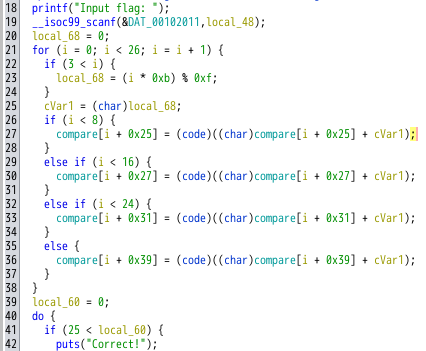
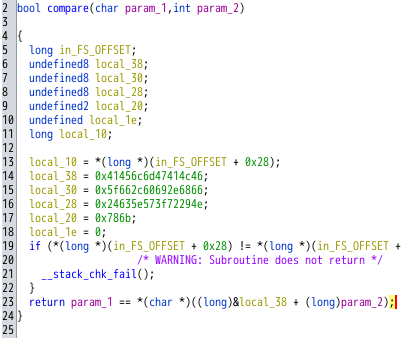
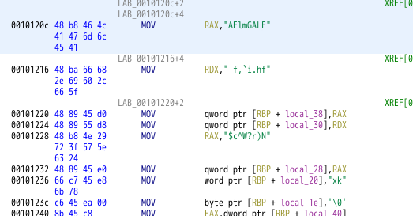
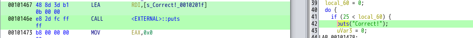

# My solution of theseus
`chall` というバイナリが与えれている．問題文から，正しいフラグを入力すれば Correct と出力される問題だとわかる．

Ghidraで解析する．
main 関数のデコンパイル window を見ると，入力文字列（local_48）を精査する前に，ループを26回まわし，compare 関数に何か前処理（21行目～38行目）を行っているようにみえる．
<figure></figure>

compare 関数も解析してみる．local 変数に怪しいバイト列が格納されている．
<figure></figure>

該当するアセンブラ（Listing window）の方で，怪しいバイト列をAscii 文字列に変換してみる．方法としては，該当するバイト列の上で右クリックし，[convert] -> [char sequences] を選択すればよい．
<figure></figure>

すると，FLAGっぽい文字列 ``FLAGmlEAfh.i`,f_N)r?W^c$kx`` が見つかるが，最初の4文字以外は間違ってそう．


そこで前処理部分に戻ると，`i > 3` のとき `local_68` を計算し，`(char) local_68` をcompare 関数のある部分のバイト列に足していることがわかる．5文字目以降ということからも，該当部分は``FLAGmlEAfh.i`,f_N)r?W^c$kx`` であると推測できる．
`local_68`を計算し，バイト列に足すスクリプトを書けばFLAGが求まる．
```python
flag = "FLAGmlEAfh.i`,f_N)r?W^c$kx"
flag_ascii = []

# 各文字をAsciiコードに変換
for j in flag:
    flag_ascii.append(ord(j))

# local_68を計算し，バイト列に足す処理
flag = ""
for i in range(0,26):
    k = 0
    if (3 < i):
        k = (i* 0xb) % 0xf
    flag += chr(flag_ascii[i] + k)

print(flag)
```

# Futher study
[angr](https://github.com/angr/angr) という動的シンボリック実行ツールを使うと，簡単に解くことができる．（angr を使って試したが，私のコードでは上手く行かなかったので Future Work とする．）

[公式リポジトリ](https://github.com/angr/angr)のExampleを用いると簡単に解けてしまう．

Correct! を出力するところに処理が進んで欲しいので，そこのアドレスを調べる．Ghidraでは，`0x00101467` とわかる．しかし，Ghidra ではPIE バイナリのimage ベースアドレスが `0x100000`と決まっており ([参考](https://github.com/NationalSecurityAgency/ghidra/issues/1020))，ベースアドレスからのオフセットは `0x1467` である．
<figure></figure>

angrでのPIEのベースアドレスは`0x400000`と決まっている．
`readelf`で調べたエントリポイントのアドレスとangrが示したエントリポイントのアドレスを見ればわかるだろう．
```python
>>> import angr
>>> b = angr.Project("./chall")
prin>>> print(hex(b.entry))
0x401100
```

よって，angr のベースアドレスにオフセット`0x1467` を加えたアドレスを指定し，Exampleスクリプトをまわす．
```python
>>> import angr
>>> 
>>> project = angr.Project("./chall", auto_load_libs=False)
>>> 
>>> @project.hook(0x401467)
... def print_flag(state):
...     print("FLAG SHOULD BE:", state.posix.dumps(0))
...     project.terminate_execution()
... 
>>> project.execute()
FLAG SHOULD BE: b'FLAG{vKCsq3jl4j_Y0uMade1t}\x00\x00\x00\x00\x00\x00\x00\x00\x00\x00\x00\x00\x00\x00\x00\x00\x00\x00\x00\x00\x00\x00\x00\x00\x00\x00\x00\x00\x00\x00\x00\x00\x00\x00'
<SimulationManager with 2 active, 25 deadended>
```