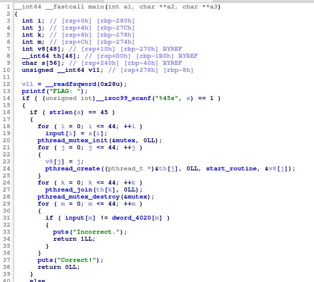
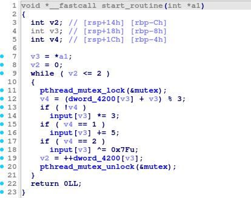

# My solution for Thread
マルチスレッドプログラミングがテーマの問題である。まず、main関数のデコンパイル結果をみる。
- `strlen(s) == 45` により、入力文字列の長さが45文字か検査
- 長さ45の入力文字列は`input`配列にコピーされる
- 45個のスレッドを作成し、それぞれのスレッドが`start_routine`を実行する
- `input`の要素と`dword_4020`の要素を比較する




`start_routine`で`input`がエンコードされるんだろうと推測できる。つまり、`dword_4020` の要素に対して`start_routine`の逆順の計算を行えば、FLAGが求まりそうである。

`start_routine`の演算処理は難しいことはしていない。注意しなければならないのは、非同期処理による演算処理の順番である。



`dword_4020` 配列の先頭4要素は`A8 8A BF A5` であるので、それらに対して以下のデコードを行うと、`FLAG`という文字が得られる。よって、`dword_4020`のインデックスに応じて、適切に演算を行えばフラグが求まりそうである。

```
>>> chr(int(((0xA8^0x7f) - 5) //3))
'F'
>>> chr((int((0x8A//3)^0x7f) - 5))
'L'
>>> chr(int((0xBF - 5)//3) ^ 0x7f)
'A'
>>> chr(int(((0xA5^0x7f) - 5)//3))
'G'
```

それぞれの要素に対してデコードを行う[スクリプト](solve.py)を書くと、フラグを求めることができる。
`FLAG{c4n_y0u_dr4w_4_1ine_be4ween_4he_thread3}`

スクリプトを作成する際に注意しなければならないのは、`dword_4020` がDWORD型の配列であるということである。Ghidraでは、[LazyGhidra](https://github.com/AllsafeCyberSecurity/LazyGhidra)を用いることで簡単に取得することができる。