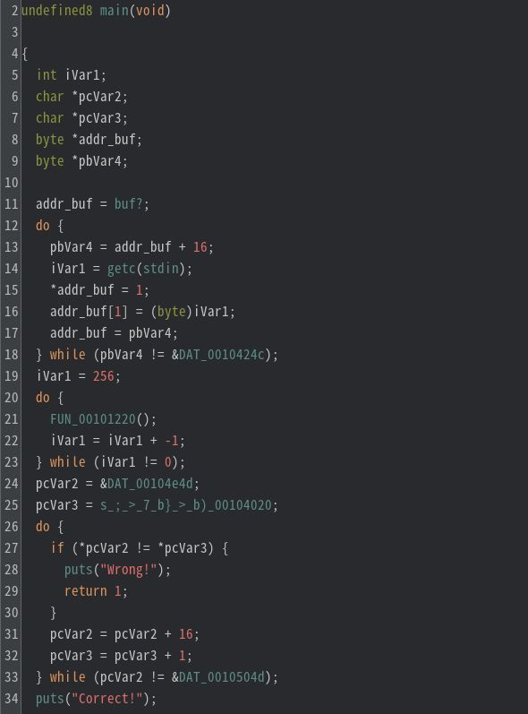

# My solution for gates

main関数のデコンパイル結果をみると、
- `getc(stdin)`により文字列の取得を行っている。
  - getcを含むdo-while文は、`pbVar4`の値が`0x0010424c`と一致するまでループする。
  - `buf?`のアドレスは`0x0010404c`であるため、do-while文は32回ループする(`(0x0010424c - 0x0010404c) / 16 = 32`)
  - フラグは32文字と推測できる
- `FUN_00101220`により入力文字列に対する処理が行われる（20 ~ 23行目）
- `*pcVar2` と `*pcVar3` の比較が行われる
  - `*pcVar2` は入力文字列に対する演算後のデータ



`pcVar3` がさすアドレスのデータは以下のとおり。つまり、この問題は演算後の値が以下の値と一致するような入力文字列を求める問題である。

```
0x633d5ba5b020  3b09 e5ae 3ef1 3781 fca1 99ae f762 7df7  ;...>.7......b}.                                                                                                                    
0x633d5ba5b030  d0cb a218 cd3e 890d d9dd 6229 8cf3 01ec  .....>....b)....
```

試しに、`FLAG{hogehogehogehogehogehogeho}` を入力として与え、エンコードされた値を見てみると、`FLAG{` と `}` のエンコード結果が一致する（それぞれの行の一バイト目が一致している）。今回は、radare2で`*pcVar2`と`*pcVar3`の比較が行われる直前にブレイクポイントをセットし、メモリの内容を確認した。

```
0x633d5ba5be4d  3b00 0004 0000 00a3 0000 00a3 0000 0001  ;...............
0x633d5ba5be5d  0900 0004 0000 00a5 0000 00a5 0000 0001  ................
0x633d5ba5be6d  e500 0004 0000 00a7 0000 00a7 0000 0001  ................
0x633d5ba5be7d  ae00 0004 0000 00a9 0000 00a9 0000 0001  ................
0x633d5ba5be8d  3e00 0004 0000 00ab 0000 00ab 0000 0001  >...............
・・・
0x633d5ba5c03d  ec00 00a0 aa81 b38c 7c00 0000 0000 0000  ........|.......
```

`}`のエンコード結果が一致していることから、このエンコードは他の文字に依存しない可能性が高い。そのため、`FUN_00101220`の内容を確認しなくても、ブルートフォースで解けそうである。

よって、radare2 を使いブルートフォースを行うスクリプトを書くことにした。このスクリプトは、メモリ状態を比較してフラグを一文字ずつ求めている。
```python
import r2pipe
import string

flag_len = 32
break_addr = 0x000010e3
known_flag = 'FLAG{' + 'A' * 26 + '}\n'

def is_correct_letter(index, r2):
    r2.cmd("dc")
    rax = r2.cmd("pv1 @rax+{}".format(hex(index * 0x10)))
    rdx = r2.cmd("pv1 @rdx+{}".format(hex(index * 0x1)))    

    if rax == rdx:
        return True
    else:
        return False

def r2_run_with_stdin(flag):
    profile = """#!/usr/bin/rarun2\nprogram=./gates\nstdin="{}" """.format(flag)
    
    with open('profile.rr2', 'w') as f:
        f.write(profile)

    r2 = r2pipe.open('gates', flags=['-e', 'dbg.profile=profile.rr2', '-2'])
    r2.cmd("db {}".format(break_addr))
    r2.cmd("doo")
    return r2


for i in range(5, flag_len-1, 1):
    for letter in string.printable[:-5]:
        tmp = known_flag[:i] + letter + known_flag[i+1:]
        r = r2_run_with_stdin(tmp)

        if is_correct_letter(i, r):
            known_flag = tmp
            print("current flag = {}".format(tmp))
            break
```

`r2pipe`を用いることで、radare2のコマンドをpythonから利用することができる。また`rarun2`を用いることで、標準入力で文字列をプログラムに渡すこともできる。