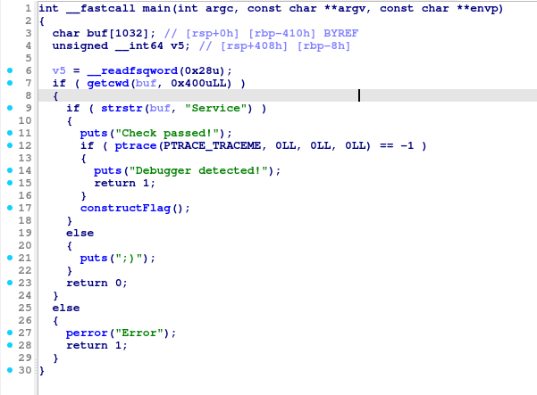
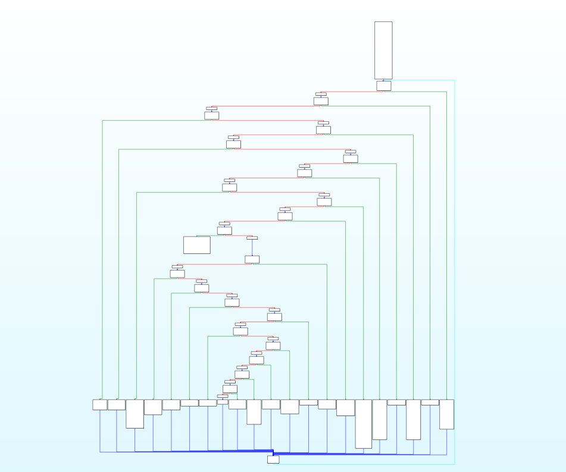
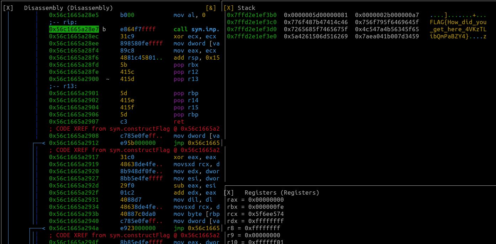

# My solution for home
main関数をida freeでデコンパイルする。すると、main関数は以下の処理を行っていることがわかる。

- 実行するディレクトリ名に`Service`という文字列が含まれているか判定し、含まれていないと実行がすぐに終了する。
- `Service`という文字列が含まれていると、`Check Passed!`を出力し、`constructFlag関数`が実行される。
- ただし、`constructFlag`が実行される前に、`ptrace`によるデバッガ検知が行われている。

    

次に`constructFlag` の解析をする。`constructFlag`の制御フローグラフを見ると、明らかに`control-flow flattening`（制御フロー平坦化）という静的解析を妨害する難読化手法が使われていることがわかる。



`constructFlag`は名前からしてフラグを生成する関数であると推測できる。関数の中身を見てみても、肝心のフラグを表示する機能はなさそうである。

そこで、考えられる解法は２通り

1. 動的解析を行い、constructFlag の実行終了直前（`Processing Completed!`を表示するところ）にブレイクポイントをセットし、実行が止まった時点でのメモリの内容をみる。（メモリにフラグがあると予想。表示されていないだけだと仮定している。）
2. Ghidraやidaのデコンパイル結果のCコードをもとに、FLAGを出力するコードを実装する。

どちらも一長一短である。動的解析は`ptrace`によるデバッガ検知を回避しなければならないし、Cコードを実装する方法はどこにフラグが格納されているのかを見つけなければならず作業量が多い。

`ptrace`によるデバッガ検知機能は単純なので、検知の回避は容易そうである。そこで今回は動的解析を使って`ptrace`のデバッガ検知を回避しながら、メモリ内のフラグをのぞくことにした。

radare2 を用いて動的解析を行う。まずは、適当なディレクトリ`Service`を作り、そこに`chal_home`をコピーする。その後、動的解析を始める。

以下のコマンドを実行すると、フラグが得られる。
```
r2 chal_home
> aaa
> db 0x000018e7 # ptrace の戻り値が-1かcmpしているアドレス
> db 0x000019f3 # Processing Completed! がprintfされるアドレス
> ood # デバッガモードで再起動
> dc
> dr eax=0 # ptrace の戻り値がeaxにあるので、0で上書き
> dc
> ps @rbp-0x60 # Processing Completed! 時点で止まるので、スタックのぞく。ちょうど、rbp-0x60のアドレスにFLAGがあった。
```

`FLAG{How_did_you_get_here_4VKzTLibQmPaBZY4}`

radare2 では、`V!` を使いビジュアルモードでstackの内容をスクロールで見ることもできるので、こちらからFLAGを見つけることもできる。




