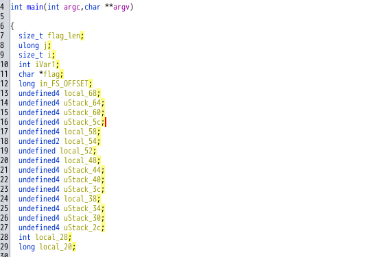
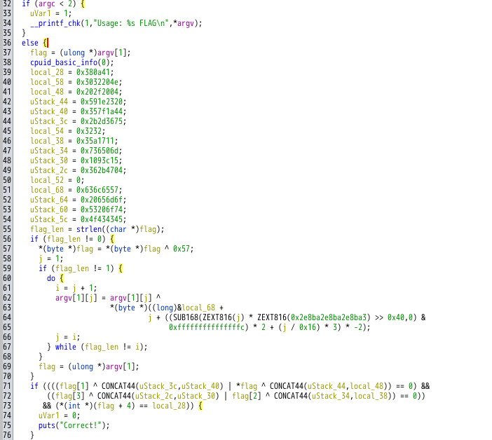
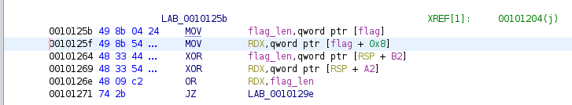
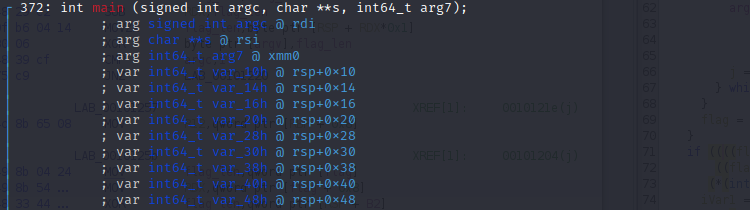
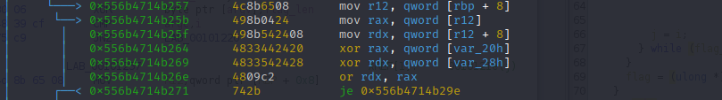
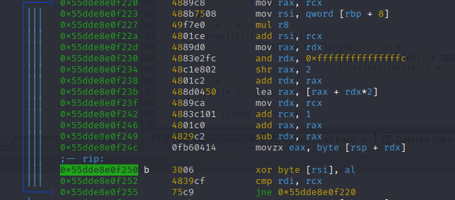

# babycmp (SECCON CTF 2022)

## 静的解析
実行してみると，コマンドライン引数でFlagを入力しないといけないことがわかる．求めたいものを入力することは不可能なので，いつものようにリバースエンジニアリングを行い比較処理を解読する必要がある．
<figure><figcaption></figcaption></figure>

シンボル情報が消されているわけでもないので，Ghidraで静的解析を行うとmain関数がすぐに見つかる．
Ghidraのデコンパイル結果の変数が分かりにくいので，[Rename Variable]や[Retype Variable]で変数名や型を変更しておく．
<figure><figcaption></figcaption></figure>
<figure><figcaption>main関数のデコンパイル結果</figcaption></figure>

main関数で行っている処理は大きく分けて二つで，
1. コマンドライン引数で入力した文字列(argv[1])のそれぞれの文字を何かとXORしている．(60行～67行)
2. 1でXORを取った文字列が内部のバイト列と一致していたらCorrect!を出力．(71行～78行)
である．

変換処理はXORだけなので，逆の処理を書けばよさそう．

    ちなみに，デコンパイル結果にあるSUB168やZEXT816はGhidra独自の組み込み関数のようなもの．うまくPコードからデコンパイルできなかったときに表示されるらしい．
    リファレンスは，[Help] > [Contents]で開くGhidra Helpで検索すれば，Ghidra Conceptsというページに詳しく書かれている． 

    例えば，ZEXT14は1バイトを4バイトにゼロ拡張する．

    ZEXT14(x) - Zero-extension operator - INT_ZEXT
        ・The digit '1' indicates the size of the input operand 'x' in bytes.
        ・The digit '4' indicates the size of the output in bytes.
            ZEXT24(0xaabb) = 0x0000aabb


## 復号スクリプト
main関数の処理1. 2. の逆の復号をすればよい．

### 2. の復号
CONCAT44は4バイトと4バイトを連結する関数のようなもので，71行目から比較しているバイト列は
```math 
uStack\_44 + local\_48 + uStack\_3c + uStack\_40 + uStack\_34 + local\_38 + uStack\_2c + uStack\_30 + local\_28
```
なので，
```python
b'\x59\x1e\x23\x20\x20\x2f\x20\x04\x2b\x2d\x36\x75\x35\x7f\x1a\x44\x07\x36\x50\x6d\x03\x5a\x17\x11\x36\x2b\x47\x04\x01\x09\x3c\x15\x38\x0a\x41'
```
と考えた．このバイト列からflagは35文字であることも分かる．
```python
bytes = [0x59, 0x1e, 0x23, 0x20, 0x20, 0x2f, 0x20, 0x04, 0x2b, 0x2d, 0x36, 0x75, 0x35, 0x7f, 0x1a, 0x44, 0x07, 0x36, 0x50, 0x6d, 0x03, 0x5a, 0x17, 0x11, 0x36, 0x2b, 0x47, 0x04, 0x01, 0x09, 0x3c, 0x15, 0x38, 0x0a, 0x41]
```

### 1. の復号
入力文字列の各バイトとXORをとっているバイトは
```c
(local_68のアドレス) + j + ((SUB168(ZEXT816(j) *ZEXT816(0x2e8ba2e8ba2e8ba3) >> 0x40,0) & 0xfffffffffffffffc) * 2 + (j /0x16 * 3) * -2)
```
で求まるアドレスに格納されているバイトである．local_68のアドレスに加算されている部分を求めてみると，0 ~ 21, 0 ~ 12になることがわかった．local68のアドレスから22バイト分のバイト列とXORをとっていることがわかる．
```python
c = b'00000000000000002e8ba2e8ba2e8ba3'
for i in range(35):
    A = (i * int(c, 16) >> 64) & 0b1111111111111111111111111111111111111111111111111111111111111100
    A = A * 2 + int(i/22) * 3
    B = i + A * (-2)
    print(B)
```

```
0
1
2
3
4
5
6
7
8
9
10
11
12
13
14
15
16
17
18
19
20
21
0
1
2
3
4
5
6
7
8
9
10
11
12
```
local_68はmain関数呼び出し時のスタック変数で，静的解析でアドレスを求めるのは難しい．

    Ghidraでlocal_68のようなローカル変数は，関数入力時のスタックフレーム内の変数である．
    68はスタックポインタの初期値からの16進数のオフセット．

Ghidraのデコンパイル結果を見るとlocal_68 から local_54までが22バイトなのでここがXORをとっているバイト列だと推測した．
```
local_68 = 0x636c6557;
uStack_64 = 0x20656d6f;
uStack_60 = 0x53206f74;
uStack_5c = 0x4f434345;
local_58 = 0x3032204e;
local_54 = 0x3232;
```
```python
xor_bytes = [0x63, 0x6c, 0x65, 0x57, 0x20, 0x65, 0x6d, 0x6f, 0x53, 0x20, 0x6f, 0x74, 0x4f, 0x43, 0x43, 0x45, 0x32, 0x32]
```
### 復号
以上を踏まえて復号スクリプトを書いたが，正しいフラグは求まらなかった．
```python
bytes = [0x59, 0x1e, 0x23, 0x20, 0x20, 0x2f, 0x20, 0x04, 0x2b, 0x2d, 0x36, 0x75, 0x35, 0x7f, 0x1a, 0x44, 0x07, 0x36, 0x50, 0x6d, 0x03, 0x5a, 0x17, 0x11, 0x36, 0x2b, 0x47, 0x04, 0x01, 0x09, 0x3c, 0x15, 0x38, 0x0a, 0x41]
c = b'00000000000000002e8ba2e8ba2e8ba3'
xor_bytes = [0x57, 0x65, 0x6c, 0x63, 0x6f, 0x6d, 0x65, 0x20, 0x74, 0x6f, 0x20, 0x53, 0x45, 0x43, 0x43, 0x4f, 0x4e, 0x20, 0x32, 0x30, 0x32, 0x32]
flag = ""
for i in range(35):
    A = (i * int(c, 16) >> 64) & 0b1111111111111111111111111111111111111111111111111111111111111100
    A = A * 2 + int(i/22) * 3
    B = i + A * (-2)
    flag += chr(bytes[i] ^ xor_bytes[B])

print(flag)
```
```
]{OCOBE$_B&p<Y
              Ib]1h@tZH(id)HzY
```

## 動的解析（radare2）
解法はあっていそうなのにフラグが求まらない．
radare2を使って，比較しているバイト列やXORをとっているバイト列をのぞいてみることにした．

### 2. 比較しているバイト列
Ghidraで見つけた比較部分のDisassemblyウィドウ
<figure><figcaption>flagと比較している部分のListing View</figcaption></figure>

```
radare2 chall.baby
> aaa 
> s main
> pdf
```
<figure><figcaption>radare2で解析した比較部分</figcaption></figure>
raxレジスタ（flagの先頭8バイト）とvar_20hの8バイトを比較していることがわかる．GhidraのCONCAT44は余計だった......

```
xor rax, qword [var_20h]
```

radare2でブレイクポイントを設置して，レジスタの中身を見る．ローカル変数はvar_20hは，@rsp+0x20のスタックレジスタを参照すればよい．
<figure><figcaption>ローカル変数とスタックレジスタの対応</figcaption></figure>

デバッグモードで，コマンドライン引数に35文字の文字列を与えて実行する．
```
radare2 -d chall.baby SECCON{AAAAAAAAAAAAAAAAAAAAAAAAAAA}
> aaa
> s main
> pdf
```

<figure><figcaption>-dでデバッグモードだとアドレスが変わるので注意</figcaption></figure>

```
[0x556b4714b180]> db 0x556b4714b264
[0x556b4714b180]> dc
hit breakpoint at: 0x556b4714b264
[0x556b4714b264]> pd 1
```

<figure><figcaption></figcaption></figure>

```
[0x556b4714b264]> px @rsp+0x20
```

<figure><figcaption></figcaption></figure>

Ghidraで解析し，比較していると推測したバイト列は間違っていたことがわかった（順序が間違っていた）．正しいバイト列は次のようになる．
```python
bytes = [0x04, 0x20, 0x2f, 0x20, 0x20, 0x23, 0x1e, 0x59, 0x44, 0x1a, 0x7f, 0x35, 0x75, 0x36, 0x2d, 0x2b, 0x11, 0x17, 0x5a, 0x03, 0x6d, 0x50, 0x36, 0x07, 0x15, 0x3c, 0x09, 0x01, 0x04, 0x47, 0x2b, 0x36, 0x41, 0x0a, 0x38]
```

### 1. XORをとっているバイト列
main関数内のXORとっている部分をradare2で見つける．
<figure><figcaption>argv[1]とXORをとっているdo-while文の部分のアセンブリ</figcaption></figure>

```
movzx eax, byte [rsp + rdx]
```
の実行後，eaxにはxorをとるバイトが入る．eaxレジスタを見てもいいし，rspを見てもよい．
```
[0x55dde8e0f180]> db 0x55dde8e0f250
[0x55dde8e0f180]> dc
[0x55dde8e0f250]> px @rsp
```

<figure><figcaption>スタックポインタの中身</figcaption></figure>

Ghidraで解析し，XORをとっていると推測したバイト列は間違っていた．（これも順序の違い．スタックの関係）

```python
xor_bytes = [0x57, 0x65, 0x6c, 0x63, 0x6f, 0x6d, 0x65, 0x20, 0x74, 0x6f, 0x20, 0x53, 0x45, 0x43, 0x43, 0x4f, 0x4e, 0x20, 0x32, 0x30, 0x32, 0x32]
```

### 正しい復号スクリプト
動的解析の結果をもとにスクリプトを書き換えた結果，フラグを得ることができた．
```python
bytes = [0x04, 0x20, 0x2f, 0x20, 0x20, 0x23, 0x1e, 0x59, 0x44, 0x1a, 0x7f, 0x35, 0x75, 0x36, 0x2d, 0x2b, 0x11, 0x17, 0x5a, 0x03, 0x6d, 0x50, 0x36, 0x07, 0x15, 0x3c, 0x09, 0x01, 0x04, 0x47, 0x2b, 0x36, 0x41, 0x0a, 0x38]
c = b'00000000000000002e8ba2e8ba2e8ba3'
xor_bytes = [0x57, 0x65, 0x6c, 0x63, 0x6f, 0x6d, 0x65, 0x20, 0x74, 0x6f, 0x20, 0x53, 0x45, 0x43, 0x43, 0x4f, 0x4e, 0x20, 0x32, 0x30, 0x32, 0x32]
flag = ""
for i in range(35):
    A = i * int(c, 16) >> 64
    A = A & 0b1111111111111111111111111111111111111111111111111111111111111100
    A = A * 2 + int(i/22) * 3
    B = i + A * (-2)
    flag += chr(bytes[i] ^ xor_bytes[B])

print(flag)
```

```
SECCON{y0u_f0und_7h3_baby_flag_YaY}
```