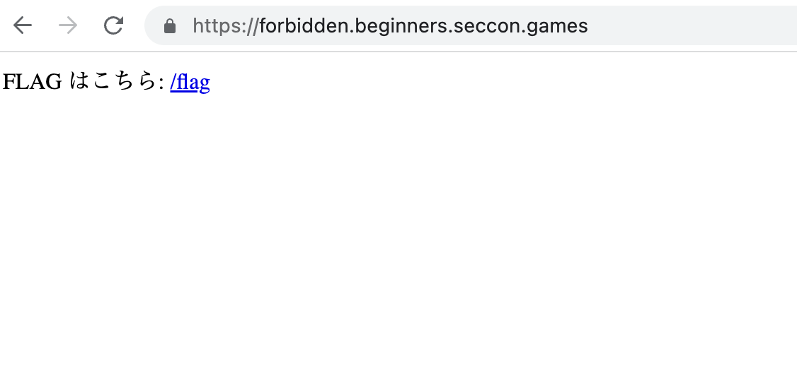
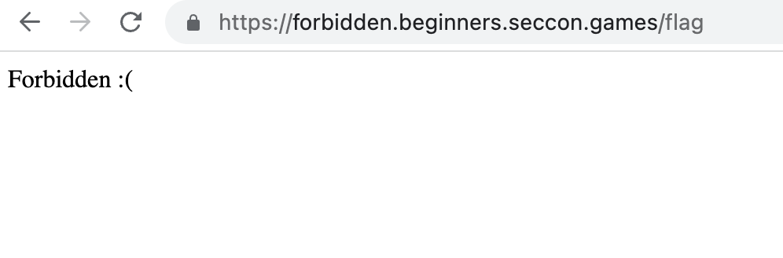
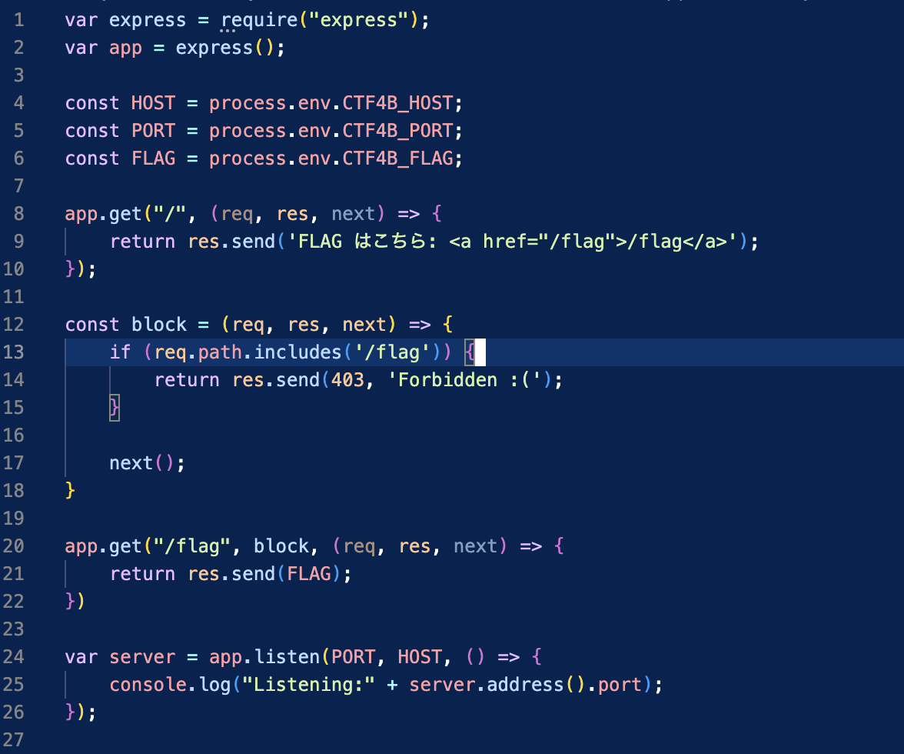
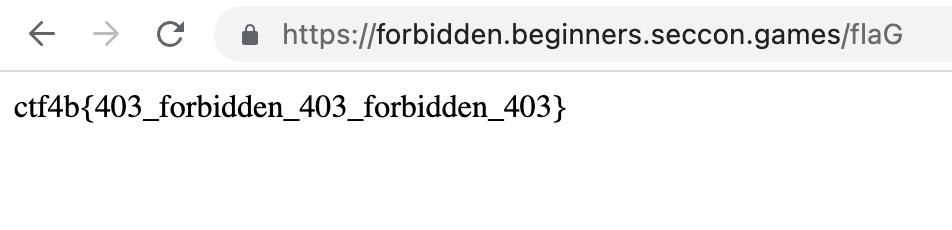

# forbidden (SECCON Begginer 2023)

> [begginer]
> You don't have permission to access /flag on this server.

# Writeup
与えられたurlから以下のような画面にアクセスできる。
<figure><figcaption></figcaption></figure>

さらに誘導通り `/flag`にアクセスすると以下の結果が得られる。
<figure><figcation></figcaption></figure>

そこで与えられたソースコードを眺める。
与えられたソースコードは以下の通りである。
<figure><figcaption></figcaption></figure>

20行目で`/flag` にアクセスできるとFLAGが帰ってくることがわかる。
しかし、実際は14行目の結果が得られている。
つまり、13行目でリクエストされたurlに文字列`/flag` を含んでいるとFLAGが得られない。

そこで、13行目の条件文について調べると、[`includes()`](https://developer.mozilla.org/ja/docs/Web/JavaScript/Reference/Global_Objects/String/includes)関数は文字の大小を区別するとわかる。

従って、url の一部を大文字にするとアクセスできるようになる。例：`/flaG`。
<figure>